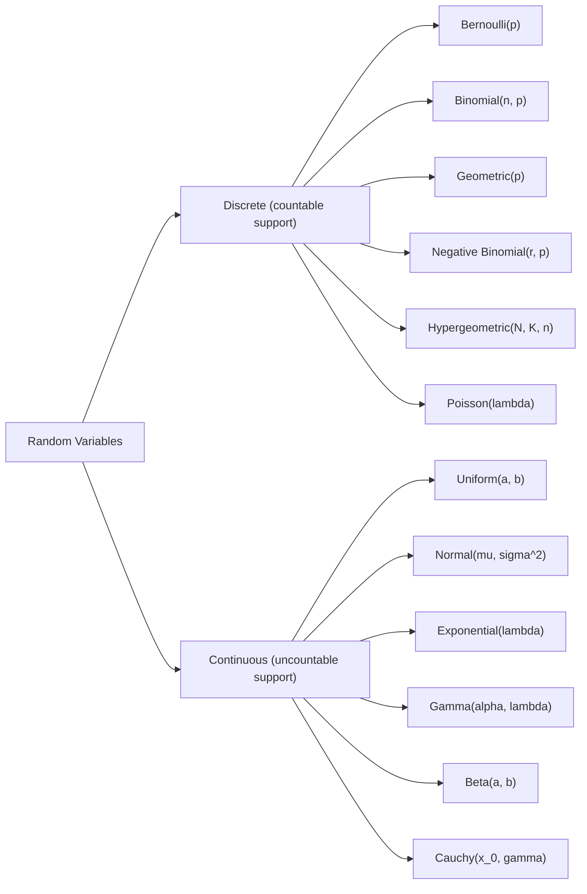

A **probability distribution** is a mathematical function that describes how probability is assigned to each possible outcome of a random variable. It is a complete specification of the random variable's behavior — not just its average, but the full shape of its uncertainty. Every inference, every model, every statistical test rests on a distributional assumption. Understanding distributions is not optional; it is the foundation.

There are really only two questions that organize everything:
1. **Is the sample space countable or uncountable?** — Discrete vs. Continuous
2. **What story generates the randomness?** — Which named distribution fits the mechanism

## The Map:

The boundary between these two worlds is real and important. The machinery is fundamentally different — PMFs vs. PDFs, sums vs. integrals — but the philosophy is the same: assign probability to events in a coherent, normalized way.

see more: [[01.Probability Density Function (PDF)]], [[02.Probability Mass Function (PMF)]]

# PART I — Discrete Distributions
_The probability lives at isolated points. We describe it with a **[[08.Probability Mass Function (PMF)|PMF]]**: $P(X = k)$._

## 1. Bernoulli$(p)$
**Definition:** The Bernoulli distribution models a single binary trial. It takes value 1 (success) with probability $p$ and value 0 (failure) with probability $1 - p$, where $p \in [0, 1]$.
**The atom. Everything discrete is built from this.**

**Story:** A single trial. Success with probability $p$, failure with $1-p$.
$$P(X = k) = p^k (1-p)^{1-k}, \qquad k \in {0, 1}.$$

| $E[X]$ | $\text{Var}(X)$ | MGF            |
| ------ | --------------- | -------------- |
| $p$    | $p(1-p)$        | $1 - p + pe^t$ |

**When to use:**
- Any situation with exactly two possible outcomes: yes/no, success/failure, heads/tails, defective/not defective.
- A coin flip with known bias.
- Whether a single email is spam or not.
- The building block inside Binomial, Geometric, and Negative Binomial derivations.

**When NOT to use:**
- When there are more than two outcomes (use Multinomial instead).
- When you have repeated trials — do not model them as separate Bernoullis when the joint structure matters (use Binomial).
- When $p$ is unknown and random — in that case, you need a prior on $p$, typically Beta.

**Key Points to Remember:**
- Variance is maximized at $p = 0.5$, where $\text{Var}(X) = 0.25$. This is when uncertainty is highest.
- At $p = 0$ or $p = 1$, variance is 0 — no randomness remains.
- Every discrete distribution is, at its heart, a way of combining Bernoullis. Keep this in mind.
- The indicator random variable $\mathbf{1}_A$ for any event $A$ is a Bernoulli with $p = P(A)$. This is one of the most powerful tools in probability.

see more: [[06.Bernoulli Distribution]]

---

## 2. Binomial$(n, p)$
**Definition:** The Binomial distribution counts the number of successes in $n$ independent and identically distributed Bernoulli$(p)$ trials. The parameter $n$ is a positive integer and $p \in [0,1]$.
**The most important discrete distribution.**

**Story:** $n$ independent Bernoulli$(p)$ trials. $X$ = number of successes.
$$P(X = k) = \binom{n}{k} p^k (1-p)^{n-k}, \qquad k = 0, 1, \ldots, n.$$

| $E[X]$ | $\text{Var}(X)$ | MGF              |
| ------ | --------------- | ---------------- |
| $np$   | $np(1-p)$       | $(pe^t + 1-p)^n$ |

**Key insight:** $X = X_1 + \cdots + X_n$ where $X_i \overset{\text{i.i.d.}}{\sim} \text{Bern}(p)$. The mean and variance follow immediately from linearity of expectation and additivity of variance under independence. You do not need to compute them from the PMF directly.

**Reproductive property:** $\text{Bin}(n_1, p) + \text{Bin}(n_2, p) = \text{Bin}(n_1 + n_2, p)$ for independent summands. The $p$ must be the same.

**When to use:**
- Fixed number $n$ of trials known in advance.
- Trials are independent of each other.
- Each trial has the same probability $p$ of success.
- Examples: number of defective items in a batch of $n$; number of heads in $n$ coin flips; number of patients who respond to a treatment in a clinical trial of $n$ patients.

**When NOT to use:**
- When sampling is done without replacement from a finite population — use Hypergeometric instead (dependence is introduced by depletion).
- When $n$ is not fixed or varies — the binomial framework breaks.
- When $p$ varies trial to trial.
- When $n$ is very large and $p$ very small — use Poisson$(np)$ as an approximation (much more computationally convenient).

**Key Points to Remember:**
- The binomial coefficient $\binom{n}{k}$ counts the number of ways to arrange $k$ successes among $n$ positions. The probability of any one such arrangement is $p^k(1-p)^{n-k}$.
- Mean $np$: intuition is that each of $n$ trials contributes $p$ to the expected count.
- When $np$ and $n(1-p)$ are both large (say, $> 5$), $\text{Bin}(n,p) \approx N(np, np(1-p))$ by the CLT.
- Symmetry: $\text{Bin}(n, p)$ reflected around $n/2$ is $\text{Bin}(n, 1-p)$.

see more: [[05.Binomial Distribution]]

---

## 3. Geometric$(p)$
**Definition:** The Geometric distribution models the number of independent Bernoulli$(p)$ trials required to achieve the first success. It is the discrete waiting-time distribution.

**The waiting distribution for the first success.**

**Story:** Keep flipping a coin with $P(\text{H}) = p$. $X$ = number of flips until the first Head.

There are **two conventions** — know which one you are using:
1) **Blitzstein convention** (trials until first success, inclusive): $$P(X = k) = (1-p)^{k-1} p, \qquad k = 1, 2, 3, \ldots$$
2) **Alternative** (failures before first success): $$P(Y = k) = (1-p)^k p, \qquad k = 0, 1, 2, \ldots$$

The relation is $Y = X - 1$. These notes use the first convention.

| Quantity        | Value                                                                 |
|-----------------|-----------------------------------------------------------------------|
| $E[X]$          | $\frac{1}{p}$                                                         |
| $\operatorname{Var}(X)$ | $\frac{1 - p}{p^2}$                                           |
| MGF             | $\frac{p e^t}{1 - (1 - p)e^t}, \quad t < -\ln(1 - p)$                |

**The Memoryless Property :** $P(X > m + n \mid X > m) = P(X > n).$

This is the only memoryless discrete distribution. Intuitively: if the coin has not landed Heads yet, the past failures tell you nothing about when the next success comes. The coin has no memory.

**When to use:**
- Time until first occurrence in a sequence of independent, identical trials.
- Number of attempts until a password is cracked (assuming random guessing).
- Number of items inspected until the first defective is found.
- Modeling waiting time in discrete-time Markov chains with a geometric holding time.

**When NOT to use:**
- When trials are not independent — past outcomes affect future ones.
- When the success probability changes over time.
- When you want to wait for more than one success — use Negative Binomial.
- When time is continuous — use Exponential instead.
- When the memoryless property is empirically violated — a geometric model is then wrong by assumption.

**Key Points to Remember:**
- Mean $1/p$: if each trial has a 10% chance of success, you expect to wait 10 trials.
- The tail probability is clean: $P(X > k) = (1-p)^k$. Easy to compute.
- Be very explicit about which convention you use — the two differ by 1 everywhere and mixing them is a common source of error.
- The memoryless property is not merely a mathematical convenience — it is a structural claim about the process. Always ask whether this assumption is justified.
see more: [[03.Geometric Distribution]]

---

## 4. Negative Binomial$(r, p)$

**Definition:** The Negative Binomial distribution models the number of trials needed to accumulate exactly $r$ successes in a sequence of independent Bernoulli$(p)$ trials. It is the natural generalization of the Geometric (which is the $r = 1$ special case).

**The natural extension of Geometric: wait for $r$ successes.**
**Story:** $X$ = number of trials needed to accumulate $r$ successes, where each trial is independent Bern$(p)$.
$$P(X = k) = \binom{k-1}{r-1} p^r (1-p)^{k-r}, \qquad k = r, r+1, r+2, \ldots$$

**Why this PMF:** The $r$-th success occurs on trial $k$. That means: exactly $r-1$ successes in the first $k-1$ trials (there are $\binom{k-1}{r-1}$ ways to arrange them), and then a success on trial $k$ (probability $p$). The last success is fixed; only the earlier $r-1$ successes vary in position.

| Quantity                 | Value                      |
|--------------------------|----------------------------|
| $E[X]$                   | $\frac{r}{p}$              |
| $\operatorname{Var}(X)$  | $\frac{r(1 - p)}{p^2}$     |

**Connection to Geometric:** $\text{NegBin}(r, p)$ is the sum of $r$ independent $\text{Geom}(p)$ random variables. This immediately gives mean $r/p$ and variance $r(1-p)/p^2$ by linearity and additivity of variance. You do not need to compute them from the PMF.

**When to use:**
- Waiting time for $r$ successes in a Bernoulli process.
- Number of sales calls needed to close $r$ deals.
- In overdispersed count data modeling (a common alternative to Poisson when variance exceeds mean — in that formulation, $r$ can be non-integer).

**When NOT to use:**
- When you only need to wait for one success — use Geometric.
- When the population is finite and sampling is without replacement — dependence breaks the framework.
- When trials are not identically distributed.

**Key Points to Remember:**
- NegBin$(1, p) =$ Geom$(p)$. Always check special cases.
- Variance $r(1-p)/p^2$ grows linearly in $r$, as does the mean. The coefficient of variation $\text{CV} = \sqrt{(1-p)/r}/p$ decreases as $r$ grows — more successes means relatively less spread.
- The PMF formula always fixes the last trial as a success. Never forget that constraint — it is why $\binom{k-1}{r-1}$ appears instead of $\binom{k}{r}$.

see more: [[04.Negative Binomial Distribution]]

---

## 5. Hypergeometric$(N, K, n)$

**Definition:** The Hypergeometric distribution models the number of successes in a sample of $n$ items drawn without replacement from a finite population of $N$ items, of which exactly $K$ are successes. It is the exact distribution for sampling without replacement.

**Sampling without replacement — where independence breaks.**
**Story:** An urn has $N$ balls: $K$ are red, $N-K$ are white. Draw $n$ balls without replacement. $X$ = number of red balls drawn.
$$P(X = k) = \frac{\binom{K}{k}\binom{N-K}{n-k}}{\binom{N}{n}}, \qquad \max(0, n-(N-K)) \leq k \leq \min(n, K).$$

| Quantity                | Value                                                          |
| ----------------------- | -------------------------------------------------------------- |
| $E[X]$                  | $\frac{nK}{N}$                                                 |
| $\operatorname{Var}(X)$ | $\frac{nK}{N} \cdot \frac{N - K}{N} \cdot \frac{N - n}{N - 1}$ |

**The finite population correction factor** $(N-n)/(N-1)$ is the key difference from the Binomial. When $N \to \infty$ with $K/N \to p$, the Hypergeometric converges to $\text{Bin}(n, p)$ — sampling without replacement from a huge population is approximately the same as sampling with replacement.

**When to use:**
- Quality control: inspecting $n$ items from a lot of $N$, when each item is not replaced.
- Auditing: reviewing $n$ accounts out of $N$, without replacement.
- Card problems: dealing $n$ cards from a deck of $N$.
- Any situation where the population is finite and items are not returned.

**When NOT to use:**
- When sampling is done with replacement — use Binomial.
- When the population is very large relative to the sample — Binomial is a good approximation and much simpler.
- When the population is not well-defined or the items are not discrete.

**Key Points to Remember:**
- The mean is the same as Binomial$(n, K/N)$. The only difference is in the variance.
- The finite population correction factor is always $\leq 1$, so the Hypergeometric always has smaller variance than the corresponding Binomial. This makes intuitive sense: without replacement, there is less uncertainty because you are learning about the population as you sample.
- The correction factor approaches 1 as $N \to \infty$, recovering the Binomial variance.
- The Binomial assumes independence (sampling with replacement). The Hypergeometric is the exact model when the population is finite and you are depleting it.

see more: [[12.Hypergeometric Distribution]]

---

## 6. Poisson$(\lambda)$
**Definition:** The Poisson distribution models the number of events occurring in a fixed interval of time or space, given that events occur at a constant average rate $\lambda > 0$ and independently of each other. It is the limiting case of the Binomial when $n \to \infty$, $p \to 0$, and $np \to \lambda$.
**The distribution of rare events. One of the most important in all of probability.**
**Story:** Events occur in time (or space) at a constant average rate $\lambda$. $X$ = number of events in a unit interval.
$$P(X = k) = \frac{e^{-\lambda} \lambda^k}{k!}, \qquad k = 0, 1, 2, \ldots$$

| Quantity                | Value                   |
| ----------------------- | ----------------------- |
| $E[X]$                  | $\lambda$               |
| $\operatorname{Var}(X)$ | $\lambda$               |
| MGF                     | $e^{\lambda (e^t - 1)}$ |

The fact that mean = variance is a **signature property** — useful for checking if Poisson is a reasonable model. If you observe count data where the variance is much larger than the mean, the Poisson is likely misspecified (consider Negative Binomial for overdispersion).

**Validity:** $\sum_{k=0}^{\infty} \frac{e^{-\lambda}\lambda^k}{k!} = e^{-\lambda} \cdot e^{\lambda} = 1.$ This uses the Taylor series $e^\lambda = \sum_{k=0}^\infty \lambda^k / k!$.

**Poisson as a Binomial Limit:**

$$\text{Bin}(n, p) \xrightarrow{n \to \infty,; p \to 0,; np \to \lambda} \text{Pois}(\lambda).$$

_Heuristic proof:_ Fix $\lambda = np$, so $p = \lambda/n$.

$$P(X=k) = \binom{n}{k}\left(\frac{\lambda}{n}\right)^k\left(1-\frac{\lambda}{n}\right)^{n-k}.$$

As $n \to \infty$: $\binom{n}{k}\frac{1}{n^k} \to \frac{1}{k!}$, $\left(1-\frac{\lambda}{n}\right)^n \to e^{-\lambda}$, $\left(1-\frac{\lambda}{n}\right)^{-k} \to 1$. Hence $P(X=k) \to \frac{e^{-\lambda}\lambda^k}{k!}$.

**Reproductive property:** If $X \sim \text{Pois}(\lambda_1)$ and $Y \sim \text{Pois}(\lambda_2)$ independently, then $X + Y \sim \text{Pois}(\lambda_1 + \lambda_2)$.

**When to use:**
- Count of events in a fixed time window or spatial region, when events are rare and independent.
- Number of phone calls arriving at a call center per hour.
- Number of mutations in a DNA strand per unit length.
- Number of accidents at an intersection per month.
- Approximating Binomial when $n$ is large and $p$ is small.

**When NOT to use:**
- When events are not independent (e.g., accidents cluster during storms — the rate is not constant).
- When the rate $\lambda$ is not constant over the interval (use a non-homogeneous Poisson process or a different model).
- When the variance is substantially larger than the mean in your data (overdispersion — use Negative Binomial).
- When the count has a fixed upper bound (use Binomial).

**Key Points to Remember:**
- Poisson is parameterized by a single number $\lambda$, which is simultaneously the mean and the variance. This is very constraining — real data often violates it.
- The Poisson process is a continuous-time process; the Poisson distribution is the count distribution implied by it.
- Poisson thinning: if $X \sim \text{Pois}(\lambda)$ and each event is independently kept with probability $p$, the retained count is $\text{Pois}(\lambda p)$.
- Poisson splitting: a Poisson$(\lambda)$ random variable can be decomposed into independent Poisson components.

see more: [[09.Poisson Distribution]]

---

# PART II — Continuous Distributions

_Probability lives on intervals. We describe it with a **[[01.Probability Density Function (PDF)|PDF]]** $f(x)$, where $P(a \leq X \leq b) = \int_a^b f(x),dx$._

## 7. Uniform$(a, b)$
**Definition:** The Uniform distribution assigns equal probability density to every point in the interval $[a, b]$. It is the maximum-entropy distribution on a bounded interval — the distribution that makes the fewest assumptions given only the range.
$$f(x) = \frac{1}{b-a}, \qquad x \in [a, b].$$
$$F(x) = \frac{x-a}{b-a}, \qquad x \in [a, b].$$

| Quantity                | Value                  |
| ----------------------- | ---------------------- |
| $E[X]$                  | $\frac{a + b}{2}$      |
| $\operatorname{Var}(X)$ | $\frac{(b - a)^2}{12}$ |

**Universality of the Uniform:** If $X$ has CDF $F$, then $F(X) \sim \text{Uniform}(0,1)$. Conversely, if $U \sim \text{Uniform}(0,1)$, then $F^{-1}(U)$ has CDF $F$. This is why every random number generator produces Uniforms — you can simulate any distribution from it using the inverse CDF method.

**When to use:**
- When all outcomes in an interval are equally likely, and you have no reason to prefer any subregion.
- As the prior in Bayesian inference when no information about a parameter is available (on a bounded support).
- As the source of randomness in simulation (inverse CDF method).
- Order statistics problems — the $k$-th order statistic of $n$ i.i.d. Uniform$(0,1)$ follows Beta$(k, n-k+1)$.

**When NOT to use:**
- When outcomes near the boundaries are less plausible than those near the center.
- When the support is unbounded — you cannot have a Uniform on $\mathbb{R}$ (it would not normalize).
- When you have genuine prior information — a more informative prior is more honest and leads to better inference.

**Key Points to Remember:**
- Uniform$(0,1)$ is the canonical continuous distribution. Every continuous distribution can be generated from it.
- The variance $(b-a)^2/12$ depends only on the length of the interval, not its location. This makes sense: shifting the interval does not change its spread.
- The CDF is linear — this is unique among continuous distributions and is the reason for the Universality result.

see more: [[03.Uniform]]

---

## 8. Normal$(\mu, \sigma^2)$
**Definition:** The Normal (Gaussian) distribution is a continuous distribution on $\mathbb{R}$ parameterized by mean $\mu \in \mathbb{R}$ and variance $\sigma^2 > 0$. It is symmetric, bell-shaped, and arises as the limiting distribution of standardized sums of independent random variables (Central Limit Theorem).

**The central distribution of all of probability and statistics.**

$$f(x) = \frac{1}{\sigma\sqrt{2\pi}} \exp!\left(-\frac{(x-\mu)^2}{2\sigma^2}\right), \qquad x \in \mathbb{R}.$$

| Quantity                | Value                                |
| ----------------------- | ------------------------------------ |
| $E[X]$                  | $\mu$                                |
| $\operatorname{Var}(X)$ | $\sigma^2$                           |
| MGF                     | $e^{\mu t + \frac{\sigma^2 t^2}{2}}$ |
**Standard Normal:** $Z \sim N(0,1)$. If $X \sim N(\mu, \sigma^2)$, then $Z = (X-\mu)/\sigma \sim N(0,1)$. The PDF of $Z$ is $\phi(z) = \frac{1}{\sqrt{2\pi}}e^{-z^2/2}$, and its CDF is $\Phi(z)$. There is no closed form for $\Phi$ — numerical tables or software are used.

**Why it is everywhere ,the CLT:** For i.i.d. $X_i$ with mean $\mu$ and variance $\sigma^2$,

$$\frac{X_1 + \cdots + X_n - n\mu}{\sigma\sqrt{n}} \xrightarrow{d} N(0,1).$$

The sum of any i.i.d. random variables, suitably normalized, converges to Normal. This is the deepest theorem in elementary probability.

**Reproductive property:** $N(\mu_1, \sigma_1^2) + N(\mu_2, \sigma_2^2) = N(\mu_1 + \mu_2, \sigma_1^2 + \sigma_2^2)$ for independent summands. Variances add; this does not hold in general for non-Normal distributions.

**When to use:**
- When the CLT applies: a quantity is a sum or average of many small, independent contributions.
- Measurement error — errors in instruments are often well modeled as Normal.
- Height, weight, test scores — when the generating mechanism is additive.
- As a prior in Bayesian inference for unbounded real-valued parameters (conjugate prior for the mean of a Normal likelihood).
- In approximating Binomial$(n,p)$ when $np$ and $n(1-p)$ are both large.

**When NOT to use:**
- When the data is bounded (e.g., probabilities, counts, positive-only quantities) — a Normal can assign probability to impossible regions.
- When the distribution is heavily skewed — use Gamma, Log-Normal, or other asymmetric distributions.
- When tails are heavier than Normal — stock returns, earthquake magnitudes, income distributions are poorly modeled by Normal tails.
- When the CLT has not yet kicked in (small $n$) — the Normal approximation may be poor.

**Key Points to Remember:**
- The Normal is not natural because nature is Normal. It is universal because of the CLT. Do not confuse the reason for its prevalence.
- 68-95-99.7 rule: $P(\mu - \sigma \leq X \leq \mu + \sigma) \approx 0.68$, $P(\mu - 2\sigma \leq X \leq \mu + 2\sigma) \approx 0.95$, $P(\mu - 3\sigma \leq X \leq \mu + 3\sigma) \approx 0.997$. see more: [[10. 68-95-99.7 Rule (Empirical Rule)]]
- Standardization $Z = (X - \mu)/\sigma$ is the single most important operation when working with Normal distributions. Always think in standard deviations.
- The Normal is fully determined by its first two moments (mean and variance). This is a special property — most distributions are not.
- Linear combinations of independent Normals are Normal. This is a closure property no other common distribution shares as broadly.

see more: [[06.Normal Distribution]]

---

## 9. Exponential$(\lambda)$
**Definition:** The Exponential distribution is the continuous distribution of the waiting time until the first event in a Poisson process with rate $\lambda > 0$. It is the unique continuous memoryless distribution.
**The continuous analogue of the Geometric. The waiting time distribution.**
**Story:** Events arrive as a Poisson process with rate $\lambda$. $X$ = waiting time until the first event.
$$f(x) = \lambda e^{-\lambda x}, \qquad x > 0.$$ $$F(x) = 1 - e^{-\lambda x}, \qquad x > 0.$$

| Quantity                | Value                                            |
| ----------------------- | ------------------------------------------------ |
| $E[X]$                  | $\frac{1}{\lambda}$                              |
| $\operatorname{Var}(X)$ | $\frac{1}{\lambda^2}$                            |
| MGF                     | $\frac{\lambda}{\lambda - t}, \quad t < \lambda$ |

**Memoryless Property (continuous version):**

$$P(X > s + t \mid X > s) = P(X > t).$$

_Proof:_ $$\frac{P(X > s+t)}{P(X > s)} = \frac{e^{-\lambda(s+t)}}{e^{-\lambda s}} = e^{-\lambda t} = P(X > t). \quad \square$$

The Exponential is the only memoryless continuous distribution. Having waited $s$ units of time without an event does not change the distribution of the remaining wait.

**When to use:**
- Waiting time between events in a Poisson process: time until a call arrives, time until a component fails (under constant failure rate assumption), time until a radioactive atom decays.
- Service times in queueing models (exponential service time is the baseline assumption).
- Survival analysis with a constant hazard rate.

**When NOT to use:**
- When the failure rate is not constant. Real-world components often have increasing failure rates over time (use Weibull). Humans have a bathtub-shaped hazard (high infant mortality, low in middle age, increasing in old age).
- When the memoryless property is empirically unreasonable — for example, if older equipment is more likely to fail, the Exponential is the wrong model.
- When waiting times have a minimum threshold (use a shifted Exponential or Gamma).
- When you are modeling the total waiting time for $k > 1$ events — use Gamma.

**Key Points to Remember:**
- Mean $1/\lambda$: if events arrive at rate 2 per hour, the expected wait is 0.5 hours. Rate and mean are reciprocals.
- The coefficient of variation (standard deviation divided by mean) is exactly 1. This is a characteristic property of the Exponential.
- The minimum of independent Exponentials is also Exponential: if $X_i \sim \text{Expo}(\lambda_i)$ independently, then $\min(X_1, \ldots, X_n) \sim \text{Expo}(\lambda_1 + \cdots + \lambda_n)$. Useful in competing risks.
- The Geometric is the discrete analogue: replace continuous time with discrete trials, and the Exponential becomes the Geometric.

see more: [[12.Exponential Distribution]]

---

## 10. Gamma$(\alpha, \lambda)$

**Definition:** The Gamma distribution is the continuous distribution of the waiting time until the $\alpha$-th event in a Poisson process with rate $\lambda$. The shape parameter $\alpha > 0$ controls the number of events waited for; the rate parameter $\lambda > 0$ controls the speed. When $\alpha$ is a positive integer, it is also called the Erlang distribution.
**The Exponential grown up. Waiting time for $\alpha$ events.**
**Story:** Waiting time until the $\alpha$-th event in a Poisson process with rate $\lambda$.
$$f(x) = \frac{\lambda^\alpha x^{\alpha-1} e^{-\lambda x}}{\Gamma(\alpha)}, \qquad x > 0,$$

where $\Gamma(\alpha) = \int_0^\infty t^{\alpha-1} e^{-t},dt$ is the Gamma function. Note $\Gamma(n) = (n-1)!$ for positive integers $n$.

| Quantity                | Value                                                               |
| ----------------------- | ------------------------------------------------------------------- |
| $E[X]$                  | $\frac{\alpha}{\lambda}$                                            |
| $\operatorname{Var}(X)$ | $\frac{\alpha}{\lambda^2}$                                          |
| MGF                     | $\left(\frac{\lambda}{\lambda - t}\right)^\alpha,\quad t < \lambda$ |

**Special cases:**
- $\Gamma(1, \lambda) = \text{Expo}(\lambda)$ — the Exponential is the $\alpha = 1$ case.
- $\Gamma(n/2, 1/2) = \chi^2(n)$ — the Chi-squared distribution, fundamental in hypothesis testing and confidence intervals.

**Connection to Negative Binomial:** The Gamma is the continuous analogue. NegBin waits for $r$ discrete successes; Gamma waits for $\alpha$ continuous Poisson events.

**When to use:**
- Waiting time for $\alpha$ events in a Poisson process.
- Modeling positive-valued, right-skewed continuous quantities: income, rainfall, insurance claims, reliability lifetimes.
- As a conjugate prior for the rate parameter $\lambda$ of a Poisson distribution in Bayesian analysis.
- As a conjugate prior for the precision (inverse variance) of a Normal distribution.

**When NOT to use:**
- When the quantity can be negative or is symmetric — the Gamma is strictly positive and right-skewed.
- When the support is bounded above — the Gamma has unbounded support on $(0, \infty)$.
- When the shape is not consistent with a sum of Exponentials (check the skewness of your data).

**Key Points to Remember:**
- The Gamma is a sum of $\alpha$ independent Expo$(\lambda)$ random variables (when $\alpha$ is a positive integer). Mean and variance follow immediately by linearity: $E[X] = \alpha/\lambda$, $\text{Var}(X) = \alpha/\lambda^2$.
- As $\alpha$ grows, the Gamma becomes more symmetric and approaches Normal by CLT — this is not a coincidence.
- The Gamma function generalizes the factorial to non-integers: $\Gamma(1/2) = \sqrt{\pi}$. This makes the Gamma distribution valid for non-integer $\alpha$.
- The rate parameterization ($\lambda$) and the scale parameterization ($\theta = 1/\lambda$) are both common. Always verify which one a textbook or software is using.

see more: [[07.Gamma Transformations]]

---

## 11. Beta$(a, b)$
**Definition:** The Beta distribution is a continuous distribution on $(0, 1)$ parameterized by two positive shape parameters $a > 0$ and $b > 0$. It is the natural distribution for modeling random probabilities, proportions, or any quantity constrained to lie between 0 and 1.
**The distribution of a probability. Lives on $[0,1]$.**

$$f(x) = \frac{x^{a-1}(1-x)^{b-1}}{B(a,b)}, \qquad x \in (0,1),$$
where $B(a,b) = \frac{\Gamma(a)\Gamma(b)}{\Gamma(a+b)}$ is the Beta function.

| Quantity                | Value                              |
| ----------------------- | ---------------------------------- |
| $E[X]$                  | $\frac{a}{a + b}$                  |
| $\operatorname{Var}(X)$ | $\frac{ab}{(a + b)^2 (a + b + 1)}$ |

**Special cases:**
- $\text{Beta}(1,1) = \text{Uniform}(0,1)$ — the flat prior, no information.
- Larger $a, b$ with $a/(a+b)$ fixed — distribution concentrates near the mean, more certainty.
- $a < 1$, $b < 1$ — U-shaped distribution, mass near 0 and 1 (bimodal at the extremes).
- $a = b$ — symmetric around $1/2$.

**Bayesian conjugate prior:** If your data is Binomial$(n, p)$ and your prior on $p$ is Beta$(a, b)$, the posterior is Beta$(a + \text{successes},; b + \text{failures})$. The Beta is the conjugate prior for the Binomial. The parameters $a$ and $b$ can be interpreted as prior pseudo-counts of successes and failures respectively.

**Order statistics connection:** The $k$-th order statistic of $n$ i.i.d. Uniform$(0,1)$ random variables has a Beta$(k, n-k+1)$ distribution.

**When to use:**
- Modeling an unknown probability $p$ in Bayesian analysis.
- Modeling proportions bounded between 0 and 1: market share, disease prevalence, fraction of budget spent.
- As a prior when you have some information about the scale of a probability (choose $a$ and $b$ to match prior mean and concentration).

**When NOT to use:**
- When the quantity is not bounded between 0 and 1.
- When the distribution is symmetric and close to Normal — a Normal approximation may be simpler if the Beta is well-concentrated.
- When the data is not proportions or probabilities — do not force the Beta on arbitrary data in $[0,1]$ without a generative justification.

**Key Points to Remember:**
- Think of $a$ as prior success count and $b$ as prior failure count. Beta$(a,b)$ is the distribution of $p$ after observing $a - 1$ successes and $b - 1$ failures from a Uniform prior.
- As $a + b \to \infty$ with $a/(a+b)$ fixed, the Beta concentrates tightly around its mean — more data, less uncertainty.
- The Beta-Binomial model is one of the most important models in Bayesian statistics. Master it.
- The normalizing constant $B(a,b) = \Gamma(a)\Gamma(b)/\Gamma(a+b)$ ensures the PDF integrates to 1. You rarely need to compute it directly — it cancels in posterior calculations.

see more: [[05.Beta Transformations]]

---

## 12. Cauchy
**Definition:** The Cauchy distribution is a symmetric, heavy-tailed continuous distribution on $\mathbb{R}$ with location parameter $x_0$ and scale parameter $\gamma > 0$. It is the ratio distribution of two independent standard Normal random variables. Crucially, it has no finite mean or variance — all moments of order 1 and above fail to exist.

**The pathological distribution. A warning about heavy tails.**

$$f(x) = \frac{1}{\pi\gamma\left(1+\left(\frac{x-x_0}{\gamma}\right)^2\right)}, \qquad x \in \mathbb{R}.$$

The standard Cauchy has $x_0 = 0$, $\gamma = 1$:

$$f(x) = \frac{1}{\pi(1+x^2)}, \qquad x \in \mathbb{R}.$$

**The mean does not exist:** The integral $\int_{-\infty}^\infty \frac{|x|}{\pi(1+x^2)},dx$ diverges. Neither does the variance, nor any higher moment. The characteristic function is $E[e^{itX}] = e^{ix_0 t - \gamma|t|}$, which exists and fully characterizes the distribution.

**When to use:**
- As a robustness check — a statistical procedure that fails catastrophically under Cauchy is fragile.
- As a prior in Bayesian analysis when you want very heavy tails and robustness to outliers (Half-Cauchy priors on scale parameters are popular in hierarchical models).
- As a theoretical counterexample to show that the LLN and CLT have conditions.
- The ratio of two independent $N(0,1)$ random variables is Cauchy — this arises in physics and signal processing.

**When NOT to use:**
- In any model where you expect the Law of Large Numbers to apply — it does not hold for Cauchy. Sample averages of Cauchy random variables do not converge.
- When you need to compute moments for inference — they do not exist.
- As a default distribution for heavy-tailed data — first check if Student's $t$ distribution (which includes Cauchy as a special case with 1 degree of freedom) is more appropriate.

**Key Points to Remember:**
- The Cauchy is the $t_1$ distribution — the Student's $t$ with 1 degree of freedom.
- The sample mean of $n$ Cauchy observations has the same Cauchy distribution as a single observation. Averaging does not reduce uncertainty. This is a stark violation of intuition.
- The Cauchy is a reminder that not every distribution has finite moments, and that the CLT has conditions. If someone assumes the LLN always works, show them the Cauchy.
- The characteristic function always exists (even when moments do not), making it the right tool for studying heavy-tailed distributions.

see more: [[09.Cauchy Distribution]]

---

# PART III — Unifying Concepts

## The CDF: One Function to Rule Them All

**Definition:** For any random variable $X$, the **cumulative distribution function** is

$$F(x) = P(X \leq x).$$

The CDF is defined for every random variable — discrete, continuous, or mixed. It is the single most universal representation of a distribution.

**Properties:**

1. $F$ is non-decreasing.
2. $F(x) \to 0$ as $x \to -\infty$; $F(x) \to 1$ as $x \to \infty$.
3. $F$ is right-continuous: $\lim_{y \downarrow x} F(y) = F(x)$.

For discrete $X$: $F$ is a staircase function, jumping at each point in the support by an amount equal to the PMF at that point.

For continuous $X$: $F$ is smooth, and $F'(x) = f(x)$ (the PDF is the derivative of the CDF).

**Key use:** $P(a < X \leq b) = F(b) - F(a)$ for any $a < b$. This works for both discrete and continuous random variables.

see more: [[10.Cumulative Distribution Function (CDF)]]

---

## Moments: Reading the Shape

**Definition:** The $n$-th moment of a random variable $X$ is $E[X^n]$. The $n$-th central moment is $E[(X - \mu)^n]$ where $\mu = E[X]$. Moments summarize the shape of a distribution numerically.

| Moment              | Formula                 | What it tells you                                        |
| ------------------- | ----------------------- | -------------------------------------------------------- |
| Mean $\mu$          | $E[X]$                  | Center of mass; where the distribution balances          |
| Variance $\sigma^2$ | $E[(X-\mu)^2]$          | Average squared deviation from mean; spread              |
| Skewness            | $E[(X-\mu)^3]/\sigma^3$ | Asymmetry; positive means right tail is heavier          |
| Kurtosis            | $E[(X-\mu)^4]/\sigma^4$ | Tail weight; Normal has kurtosis 3 (excess kurtosis = 0) |

**The MGF** $M_X(t) = E[e^{tX}]$ encodes all moments via differentiation: $M_X^{(n)}(0) = E[X^n]$. It also uniquely identifies the distribution (when it exists in a neighborhood of $t = 0$) and makes sums of independent random variables easy to analyze — the MGF of a sum is the product of MGFs.

**Key Points to Remember:**
- The MGF does not always exist (Cauchy has no MGF). The characteristic function $E[e^{itX}]$ always exists and can substitute for the MGF in such cases.
- When the MGF of a sum factors as a product of known MGFs, you can immediately identify the distribution of the sum. This is how reproductive properties are proved.
- Matching moments is not the same as identifying a distribution — there exist distributions with the same moments but different CDFs (the lognormal is a famous example).

see more: [[05.Moment Generating Function (MGF)]]

---

## The Exponential Family (Big Picture)

**Definition:** A parametric family of distributions belongs to the **exponential family** if the density (or PMF) can be written as:

$$f(x \mid \theta) = h(x)\exp!\bigl(\eta(\theta)T(x) - A(\theta)\bigr).$$

Here, $T(x)$ is the **sufficient statistic**, $\eta(\theta)$ is the **natural parameter**, $A(\theta)$ is the **log-partition function** (log normalizing constant), and $h(x)$ is the base measure.

This includes: Bernoulli, Binomial, Poisson, Exponential, Gamma, Beta, Normal. The Cauchy does **not** belong — its density cannot be written in this form.

**Why it matters:**

- Sufficient statistics: $T(X)$ contains all information about $\theta$ present in the data. You do not need the full data, only the sufficient statistic.
- Conjugate priors arise naturally from the exponential family structure — the prior and posterior have the same form.
- The MLE has a simple form: it equates the observed sufficient statistic to its expected value.
- The exponential family is the foundation of Generalized Linear Models (GLMs) in statistics and machine learning.

see more: [[01.Exponential Family]]

---

## A Cheat Sheet of Limits and Connections

$$\text{Bern}(p) \xrightarrow{\text{sum of } n} \text{Bin}(n,p) \xrightarrow{n\to\infty,; p\to 0} \text{Pois}(\lambda) \xrightarrow{\lambda \to \infty,; \text{CLT}} N(\lambda, \lambda)$$

$$\text{Geom}(p) \xrightarrow{\text{sum of } r} \text{NegBin}(r,p) \qquad\qquad \text{Expo}(\lambda) \xrightarrow{\text{sum of } \alpha} \text{Gamma}(\alpha, \lambda)$$

$$\text{Bin}(n, K/N) \xrightarrow{N\to\infty} \text{Hypergeometric}(N,K,n)$$

$$\text{Beta}(1,1) = \text{Uniform}(0,1)$$

$$\text{Cauchy} = t_1 \qquad \text{(Student's } t \text{ with 1 degree of freedom)}$$

**Reading this cheat sheet:** The horizontal arrows show limiting relationships — when one distribution is a good approximation for another under certain parameter regimes. The vertical structure separates discrete (top row) from continuous (third row). The paired relationships (Geom/NegBin, Expo/Gamma) show how waiting for one event extends to waiting for multiple events.

## Master Table of Distributions

| Distribution            | Type       | Support          | Mean             | Variance                                   | Key Story                         |
| ----------------------- | ---------- | ---------------- | ---------------- | ------------------------------------------ | --------------------------------- |
| Bernoulli$(p)$          | Discrete   | ${0,1}$          | $p$              | $p(1-p)$                                   | Single binary trial               |
| Binomial$(n,p)$         | Discrete   | ${0,\ldots,n}$   | $np$             | $np(1-p)$                                  | Count of successes in $n$ trials  |
| Geometric$(p)$          | Discrete   | ${1,2,\ldots}$   | $1/p$            | $(1-p)/p^2$                                | Trials until first success        |
| NegBin$(r,p)$           | Discrete   | ${r,r+1,\ldots}$ | $r/p$            | $r(1-p)/p^2$                               | Trials until $r$-th success       |
| Hypergeometric          | Discrete   | integers         | $nK/N$           | $n\frac{K}{N}\frac{N-K}{N}\frac{N-n}{N-1}$ | Sampling without replacement      |
| Poisson$(\lambda)$      | Discrete   | ${0,1,\ldots}$   | $\lambda$        | $\lambda$                                  | Count of rare events              |
| Uniform$(a,b)$          | Continuous | $[a,b]$          | $(a+b)/2$        | $(b-a)^2/12$                               | Equal density on interval         |
| Normal$(\mu,\sigma^2)$  | Continuous | $\mathbb{R}$     | $\mu$            | $\sigma^2$                                 | CLT limit of sums                 |
| Exponential$(\lambda)$  | Continuous | $(0,\infty)$     | $1/\lambda$      | $1/\lambda^2$                              | Waiting time, first Poisson event |
| Gamma$(\alpha,\lambda)$ | Continuous | $(0,\infty)$     | $\alpha/\lambda$ | $\alpha/\lambda^2$                         | Waiting time, $\alpha$-th event   |
| Beta$(a,b)$             | Continuous | $(0,1)$          | $a/(a+b)$        | $ab/[(a+b)^2(a+b+1)]$                      | Distribution of a probability     |
| Cauchy                  | Continuous | $\mathbb{R}$     | undefined        | undefined                                  | Ratio of two standard Normals     |

