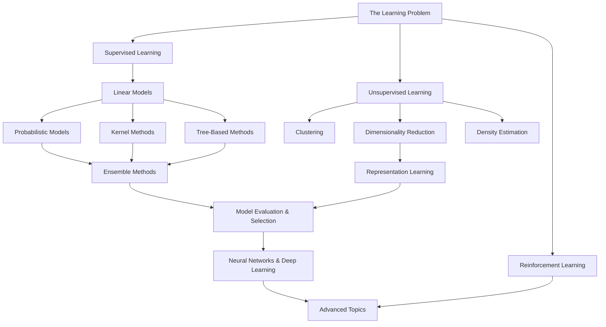

> _"A computer program is said to learn from experience E with respect to some class of tasks T and performance measure P, if its performance at tasks in T, as measured by P, improves with experience E."_ — Tom Mitchell, 1997

This is the index for everything machine learning. It is not a summary — it is a map. Every note linked here should be derivable from first principles, implementable from scratch, and explainable without hand-waving. The sequencing below is intentional: each section assumes the one before it.

**Prerequisites before anything here:** [[00.Maths]] · [[00.Python]] · [[00.Data Structures and Algorithms]]

## ✦ How to Use This Index

```
Read the note → Derive the key equations by hand → Implement from scratch → Verify against sklearn/PyTorch → Move on
```

The column _"You know this when..."_ in each section is the exit criterion. Don't move forward until you can clear it.

---

## ✦ The Full Map




## ✦ Part 0 — Foundations of Learning

_Before algorithms: what does it mean to learn from data?_

### 0.1 The Learning Problem

- [[01.The Learning Problem|The Learning Problem]]
    - What is a hypothesis class $\mathcal{H}$?
    - The three components: task $T$, experience $E$, performance $P$
    - Inductive bias — why every learner assumes something
    - The No Free Lunch theorem — why no algorithm dominates all problems
    - Types of learning: supervised, unsupervised, semi-supervised, self-supervised, reinforcement

> _You know this when:_ you can explain why the NFL theorem does not make ML useless, and articulate what assumption a linear model makes about the world.

**References:** AIMA Ch. 18.1 · ESL Ch. 2.1–2.3 · CS 229 Lecture 1

---

### 0.2 Statistical Learning Theory

- [[02.Statistical Learning Theory|Statistical Learning Theory]]
    - The formalisation: data distribution $\mathcal{D}$, population risk vs. empirical risk
    - Empirical Risk Minimisation (ERM)
    - Generalisation gap: $R(\hat{f}) - \hat{R}(\hat{f})$
    - PAC learning — what "probably approximately correct" actually means
    - VC dimension — measuring the richness of a hypothesis class
        - VC dimension of hyperplanes in $\mathbb{R}^d$ is $d+1$
        - VC dimension of $k$-nearest neighbours is $\infty$ — why?
    - Bias-variance-noise decomposition (full derivation) $$\mathbb{E}[(y - \hat{f}(x))^2] = \text{Bias}^2 + \text{Variance} + \sigma^2$$
    - Occam's Razor as a formalised principle: simpler hypotheses generalise better

> _You know this when:_ you can derive the bias-variance decomposition from the definition of expected squared loss, and state what VC dimension measures.

**References:** ESL Ch. 2.9, 7.1–7.3 · PRML Ch. 1.3 · CS 229 Notes on Learning Theory

---

### 0.3 Probability & Statistics Review for ML

- [[03.Probability Review|Probability Review]]
    - Maximum Likelihood Estimation (MLE) — deriving it from scratch
    - Maximum A Posteriori (MAP) — MLE + prior
    - The connection: L2 regularisation = Gaussian prior, L1 = Laplace prior
    - Bayes' theorem: $P(\theta | \mathcal{D}) \propto P(\mathcal{D}|\theta) P(\theta)$
    - Exponential family distributions — why they matter (sufficient statistics, conjugacy)
    - Information theory: entropy $H(X)$, KL divergence $D_{KL}(P | Q)$, mutual information

> _You know this when:_ you can derive Ridge regression as MAP estimation under a Gaussian prior, and show that MLE for a Gaussian recovers the sample mean and variance.

**References:** PRML Ch. 1–2 · ESL Ch. 2.6 · CS 229 Probability Notes

---

## ✦ Part 1 — Supervised Learning

_Learning $f: \mathcal{X} \to \mathcal{Y}$ from labelled examples $(x_i, y_i) \sim \mathcal{D}$_

### 1.1 Linear Regression

- [[01.Linear Regression|Linear Regression]]
    - Model: $\hat{y} = w^Tx + b$, loss: $\mathcal{L} = \frac{1}{n}|Xw - y|^2$
    - **Closed-form solution (Normal Equation):** $\hat{w} = (X^TX)^{-1}X^Ty$ — full derivation
        - Geometric interpretation: projection onto the column space of $X$
        - When does $(X^TX)$ fail to be invertible? Multicollinearity.
    - **Gradient descent solution:** $w \leftarrow w - \alpha \nabla_w \mathcal{L}$
        - Batch, mini-batch, stochastic variants
        - Learning rate schedules
    - Probabilistic view: MLE under Gaussian noise assumption recovers OLS
    - **Regularisation**
        - Ridge (L2): $\mathcal{L} + \lambda |w|^2$ → shrinks coefficients, never zero
        - Lasso (L1): $\mathcal{L} + \lambda |w|_1$ → sparse solutions, feature selection
        - Elastic Net: convex combination of L1 and L2
    - Polynomial regression as feature engineering (not a new model — same linear model, richer features)

> _You know this when:_ you can derive the normal equation from $\nabla_w \mathcal{L} = 0$ without looking it up, and implement both the closed-form and gradient descent solutions in NumPy.

**References:** ESL Ch. 3 · PRML Ch. 3 · Géron Ch. 4 · CS 229 Lecture 2–3

---

### 1.2 Logistic Regression

- [[02.Logistic Regression|Logistic Regression]]
    - Why linear regression fails for classification
    - The sigmoid function: $\sigma(z) = \frac{1}{1 + e^{-z}}$, its derivative: $\sigma'(z) = \sigma(z)(1-\sigma(z))$
    - Model: $P(y=1|x) = \sigma(w^Tx + b)$
    - Loss: **Binary cross-entropy** (negative log-likelihood, not MSE — derive why) $$\mathcal{L} = -\frac{1}{n}\sum_i \left[ y_i \log \hat{p}_i + (1-y_i)\log(1-\hat{p}_i) \right]$$
    - Gradient: $\nabla_w \mathcal{L} = \frac{1}{n}X^T(\hat{p} - y)$ — the residual form
    - **Multi-class: Softmax regression**
        - Softmax: $\hat{p}_k = \frac{e^{z_k}}{\sum_j e^{z_j}}$
        - Categorical cross-entropy loss
        - Log-sum-exp trick for numerical stability
    - Decision boundary is linear in feature space
    - Regularisation: L2 regularised logistic regression (default in sklearn)

> _You know this when:_ you can implement logistic regression with gradient descent in ~30 lines of NumPy, with no sklearn.

**References:** ESL Ch. 4.4 · PRML Ch. 4.3 · Géron Ch. 4 · CS 229 Lecture 5

---

### 1.3 Generalised Linear Models

- [[03.Generalised Linear Models|Generalised Linear Models]]
    - The unifying framework: exponential family + link function
    - Canonical GLMs: Gaussian (OLS), Bernoulli (logistic), Poisson (count data)
    - Why the gradient $\nabla_w \mathcal{L} = X^T(y - \hat{y})$ has the same form for all GLMs

> _You know this when:_ you can derive logistic regression as a GLM with Bernoulli family and logit link.

**References:** ESL Ch. 4 · CS 229 GLM Notes

---

### 1.4 Support Vector Machines

- [[04.Support Vector Machines|Support Vector Machines]]
    - The margin: $\frac{2}{|w|}$, why maximising it is the right objective
    - Hard-margin SVM: $\min \frac{1}{2}|w|^2$ s.t. $y_i(w^Tx_i + b) \geq 1$
    - Soft-margin SVM: slack variables $\xi_i$, the $C$ hyperparameter
    - **The Dual Problem** (Lagrangian duality)
        - KKT conditions
        - Dual formulation: $\max \sum_i \alpha_i - \frac{1}{2}\sum_{i,j}\alpha_i\alpha_j y_i y_j x_i^T x_j$
        - Support vectors: the training points with $\alpha_i > 0$
    - **The Kernel Trick**
        - Key insight: dual depends only on $x_i^T x_j$ — replace with $k(x_i, x_j) = \phi(x_i)^T\phi(x_j)$
        - Common kernels: linear, polynomial, RBF (Gaussian)
        - Mercer's theorem: when is $k$ a valid kernel?
    - Hinge loss: $\max(0, 1 - y_i \hat{y}_i)$ — the SVM loss as a convex surrogate
    - SMO algorithm (conceptual understanding)

> _You know this when:_ you can explain why SVMs only depend on support vectors, and prove that the RBF kernel corresponds to an infinite-dimensional feature map.

**References:** ESL Ch. 12 · PRML Ch. 7 · CS 229 Lecture 6–7

---

### 1.5 Decision Trees

- [[05.Decision Trees|Decision Trees]]
    - The CART algorithm: recursive binary splitting
    - **Splitting criteria**
        - Regression: variance reduction / MSE
        - Classification: Gini impurity $\sum_k p_k(1-p_k)$
        - Information gain: $H(\text{parent}) - \sum \frac{n_j}{n}H(\text{child}_j)$
    - Why information gain prefers high-cardinality features (and why Gain Ratio fixes this)
    - Stopping criteria: max depth, min samples per leaf, min impurity decrease
    - Pruning: cost-complexity pruning (CART), reduced error pruning
    - High variance of trees — why they overfit and why ensembles fix this
    - Trees as piecewise-constant function approximators

> _You know this when:_ you can implement a classification tree with Gini splitting in pure Python, and explain why it has high variance.

**References:** ESL Ch. 9.2 · PRML Ch. 14.4 · Géron Ch. 6 · AIMA Ch. 18.3

---

### 1.6 Naive Bayes

- [[06.Naive Bayes|Naive Bayes]]
    - The generative model approach: model $P(x, y)$ not just $P(y|x)$
    - The conditional independence assumption: $P(x|y) = \prod_j P(x_j|y)$
    - Why "naive" — when the assumption holds, when it doesn't
    - **Variants**
        - Gaussian NB: continuous features, Gaussian $P(x_j|y)$
        - Multinomial NB: count features, text classification
        - Bernoulli NB: binary features
    - Laplace smoothing — why log-probability of zero is catastrophic
    - Despite the "naive" assumption: often competitive on text, extremely fast

> _You know this when:_ you can derive the Multinomial NB classifier from Bayes' theorem and implement a spam filter from scratch.

**References:** PRML Ch. 8.2 (brief) · Géron Ch. 4 (brief) · CS 229 Lecture 5 (GDA)

---

### 1.7 k-Nearest Neighbours

- [[07.k-Nearest Neighbours|k-Nearest Neighbours]]
    - Non-parametric: no explicit training, all computation at inference
    - The decision rule: $\hat{y} = \text{majority vote}_{x_j \in \mathcal{N}_k(x)}(y_j)$
    - Choice of $k$: small $k$ → high variance, large $k$ → high bias
    - Distance metrics: Euclidean, Manhattan, Minkowski, cosine — when each matters
    - The curse of dimensionality: why KNN degrades in high dimensions
        - In $d$ dimensions, the ratio of volume of a thin shell to the whole sphere → 1 as $d \to \infty$
        - Nearest neighbours become equidistant
    - Efficient lookup: KD-trees ($O(\log n)$ query), ball trees
    - Normalisation is not optional — KNN is distance-sensitive

> _You know this when:_ you can explain the curse of dimensionality geometrically and implement KNN in NumPy.

**References:** ESL Ch. 2.3 · Géron Ch. 3 (briefly) · CLRS on data structures for spatial queries

---

## ✦ Part 2 — Model Evaluation and Selection

_How do we know if our model is good? How do we choose between models?_

### 2.1 Train, Validation, and Test Sets

- [[01.Train Validation and Test Sets|Train, Validation, and Test Sets]]
    - Why you need three sets, not two
    - The test set is a finite resource — spend it once
    - Data leakage: the most common reason ML models fail in production
    - Stratified splits for imbalanced classes

**References:** Géron Ch. 2 · ESL Ch. 7.2

---

### 2.2 Cross-Validation

- [[02.Cross Validation|Cross-Validation]]
    - k-Fold CV: procedure, bias-variance tradeoff of $k$
    - Leave-One-Out CV (LOOCV): when it makes sense, why it's high-variance
    - Stratified k-fold for classification
    - Time-series CV: forward chaining — why standard k-fold leaks the future
    - Nested CV for simultaneous model selection and evaluation

> _You know this when:_ you can implement k-fold CV from scratch without sklearn's `cross_val_score`.

**References:** ESL Ch. 7.10 · Géron Ch. 2

---

### 2.3 Performance Metrics

- [[03.Performance Metrics|Performance Metrics]]
    - **Regression:** MSE, RMSE, MAE, $R^2$, MAPE
    - **Classification:**
        - Confusion matrix — TP, FP, TN, FN
        - Accuracy (and when it's misleading: class imbalance)
        - Precision $= \frac{TP}{TP+FP}$, Recall $= \frac{TP}{TP+FN}$, F1-score
        - ROC curve and AUC — classifier performance across all thresholds
        - Precision-recall curve — preferred under class imbalance
        - Matthews Correlation Coefficient (MCC) — more robust than F1
    - **Probabilistic classifiers:** log-loss, Brier score, calibration
    - Choosing the right metric: business context matters

**References:** Géron Ch. 3 · ESL Ch. 7.4 · Müller & Guido Ch. 5

---

### 2.4 Bias-Variance Tradeoff and Regularisation

- [[04.Bias Variance Tradeoff|Bias-Variance Tradeoff]]
    - Diagnosing underfitting vs. overfitting from learning curves
    - Model complexity vs. generalisation error (the U-curve)
    - Regularisation as the general solution to overfitting
        - L1 (Lasso): sparse models, implicit feature selection
        - L2 (Ridge): coefficient shrinkage, numerical stability
        - Early stopping: equivalent to L2 regularisation for gradient descent
        - Dropout, data augmentation (preview — detail in deep learning)
    - The double descent phenomenon — why more model capacity sometimes helps

**References:** ESL Ch. 7 · PRML Ch. 3.4 · CS 229 Lecture 3

---

### 2.5 Hyperparameter Tuning

- [[05.Hyperparameter Tuning|Hyperparameter Tuning]]
    - Grid search: exhaustive, expensive, $O(n^k)$ for $k$ hyperparameters
    - Random search: often better — why? (Bergstra & Bengio 2012)
    - Bayesian optimisation: model the objective, sample intelligently
        - Gaussian process surrogate model
        - Acquisition functions: Expected Improvement (EI), UCB
    - Successive halving and Hyperband — budget-aware tuning

**References:** ESL Ch. 7.3 · Géron Ch. 2

---

## ✦ Part 3 — Ensemble Methods

_Many weak learners → one strong learner_

### 3.1 Bagging and Random Forests

- [[01.Bagging and Random Forests|Bagging and Random Forests]]
    - Bagging (Bootstrap Aggregating): train on bootstrap samples, aggregate predictions
        - Variance reduction: if base learners are i.i.d. with variance $\sigma^2$ and correlation $\rho$, ensemble variance $= \rho\sigma^2 + \frac{1-\rho}{B}\sigma^2$
        - Decorrelation is the key — why averaging works
    - Out-of-bag (OOB) evaluation — free validation from bootstrap
    - **Random Forests:** Bagging + random feature subsets at each split
        - Default: $\sqrt{d}$ features for classification, $d/3$ for regression
        - Feature importance: mean decrease in impurity
        - Permutation importance: more reliable, model-agnostic
    - Extremely Randomised Trees (Extra-Trees): random thresholds → lower variance

> _You know this when:_ you can derive why bagging reduces variance but not bias, and implement a small random forest from scratch using your decision tree.

**References:** ESL Ch. 15 · Géron Ch. 7 · Müller & Guido Ch. 2

---

### 3.2 Boosting

- [[02.Boosting|Boosting]]
    - The meta-idea: train sequentially, each model focuses on previous errors
    - **AdaBoost**
        - Reweight misclassified samples, upweight accurate classifiers
        - Final prediction: weighted majority vote
        - Equivalent to additive model fitting with exponential loss
    - **Gradient Boosting**
        - Fit each new tree to the **negative gradient** of the loss (the "pseudo-residuals")
        - General framework: works with any differentiable loss function
        - The three knobs: $n_estimators$, $learning_rate$, $max_depth$
        - Shrinkage + subsampling (Stochastic Gradient Boosting)
    - **XGBoost**
        - Second-order Taylor expansion of loss — uses Hessian information
        - Regularised objective: controls leaf weights explicitly
        - Column and row subsampling, approximate split finding
        - Why it dominates tabular ML competitions
    - **LightGBM and CatBoost:** histogram-based splits, native categoricals

> _You know this when:_ you can derive the gradient boosting update rule from Taylor expansion of the loss, and explain why it's called "gradient" boosting.

**References:** ESL Ch. 10 · Géron Ch. 7 · CS 229 (Boosting notes)

---

### 3.3 Stacking and Blending

- [[03.Stacking|Stacking and Blending]]
    - Stacking: use a meta-learner to combine base model predictions
    - The leakage problem and why cross-val predictions are used as meta-features
    - Blending: simpler holdout-based variant
    - When stacking helps and when it's overkill

**References:** ESL Ch. 8.8 · Géron Ch. 7

---

## ✦ Part 4 — Unsupervised Learning

_Finding structure in unlabelled data_

### 4.1 Clustering

- [[Clustering|Clustering]]

#### K-Means

- [[01.K-Means|K-Means]]
    - The Lloyd's algorithm: assign → update → repeat
    - Objective: $\min_{C_k, \mu_k} \sum_k \sum_{x \in C_k} |x - \mu_k|^2$
    - Convergence guaranteed (to a local minimum), but not to global optimum
    - Sensitivity to initialisation → K-Means++ seeding
    - Choosing $k$: elbow method, silhouette score, gap statistic
    - Limitations: assumes spherical clusters, equal variance, equal cluster size

#### Gaussian Mixture Models (GMM)

- [[02.GMM|Gaussian Mixture Models]]
    - Soft assignments: each point has probability of belonging to each cluster
    - Model: $p(x) = \sum_k \pi_k \mathcal{N}(x|\mu_k, \Sigma_k)$
    - **Expectation-Maximisation (EM)** — the key algorithm
        - E-step: compute responsibilities $r_{ik} = P(z_i = k | x_i)$
        - M-step: update $\pi_k, \mu_k, \Sigma_k$ using weighted MLEs
        - EM as coordinate ascent on the ELBO (preview to variational inference)
        - Convergence: guaranteed to increase log-likelihood, not to global max
    - GMM vs. K-Means: GMM is the probabilistic generalisation

#### Hierarchical Clustering

- [[03.Hierarchical|Hierarchical Clustering]]
    - Agglomerative: bottom-up merging
    - Linkage criteria: single, complete, average, Ward's
    - The dendrogram: reading and cutting
    - $O(n^2 \log n)$ complexity — doesn't scale to large $n$

#### Density-Based Clustering (DBSCAN)

- [[04.DBSCAN|DBSCAN]]
    - Core points, border points, noise points
    - Parameters: $\epsilon$ (neighbourhood radius), $\text{min_samples}$
    - Discovers arbitrary shapes — not limited to convex clusters
    - Robust to outliers (they become noise)
    - HDBSCAN: hierarchical variant, more robust to varying density

> _You know this when:_ you can implement K-Means and the E-step of EM in NumPy, and explain when you'd choose GMM over K-Means.

**References:** ESL Ch. 14.3 · PRML Ch. 9 · Géron Ch. 9 · Müller & Guido Ch. 3

---

### 4.2 Dimensionality Reduction

- [[Dimensionality Reduction|Dimensionality Reduction]]

#### Principal Component Analysis (PCA)

- [[01.PCA|PCA]]
    - The objective: find orthogonal directions of maximum variance
    - Full derivation: $\mathbf{v}_1 = \arg\max_{|\mathbf{v}|=1} \mathbf{v}^T \Sigma \mathbf{v}$ → eigenvalue problem
    - Algorithm: centre data → compute covariance → eigendecomposition (or SVD)
    - **SVD connection:** $X = U\Sigma V^T$ — principal components are rows of $V^T$
    - Explained variance ratio: choosing the number of components
    - Reconstruction and reconstruction error
    - Whitening: transforming to uncorrelated, unit-variance components
    - Limitations: linear, no semantic structure, sensitive to scale

#### Kernel PCA

- [[02.Kernel PCA|Kernel PCA]]
    - Nonlinear extension via the kernel trick
    - PCA in the RKHS (reproducing kernel Hilbert space)
    - RBF kernel PCA for unfolding nonlinear manifolds

#### t-SNE

- [[03.t-SNE|t-SNE]]
    - Preserves local structure, not global
    - High-dim similarities via Gaussian, low-dim via Student-t (heavier tails)
    - Why the t-distribution? Avoids the crowding problem
    - The perplexity hyperparameter: effective number of neighbours
    - Non-convex optimisation — results vary with random seed
    - Only for visualisation — not a general-purpose feature extractor

#### UMAP

- [[04.UMAP|UMAP]]
    - Theoretical basis: Riemannian geometry and fuzzy simplicial sets
    - Faster than t-SNE, preserves more global structure
    - Supports out-of-sample projection (t-SNE does not)
    - Increasingly preferred for visualisation and as a preprocessing step

> _You know this when:_ you can derive PCA from the eigenvalue problem, implement it via SVD in NumPy, and explain why t-SNE plots cannot be used to measure inter-cluster distances.

**References:** ESL Ch. 14.5 · PRML Ch. 12 · Géron Ch. 8 · Müller & Guido Ch. 3

---

### 4.3 Density Estimation

- [[03.Density Estimation|Density Estimation]]
    - **Histograms:** bin width as a hyperparameter, curse of dimensionality
    - **Kernel Density Estimation (KDE):**
        - $\hat{p}(x) = \frac{1}{nh}\sum_i K!\left(\frac{x - x_i}{h}\right)$
        - Bandwidth $h$: the KDE equivalent of bin width
        - Common kernels: Gaussian, Epanechnikov (optimal)
        - Bandwidth selection: Silverman's rule of thumb, cross-validation
    - **Gaussian Mixture Models** (covered above — also a density estimator)

**References:** ESL Ch. 6.6 · PRML Ch. 2.5

---

### 4.4 Representation Learning

- [[04.Representation Learning|Representation Learning]]
    - The core idea: learn features, not just models
    - **Autoencoders**
        - Encoder $q_\phi(z|x)$, decoder $p_\theta(x|z)$, bottleneck $z$
        - Undercomplete vs. overcomplete autoencoders
        - Denoising autoencoders: reconstruct clean $x$ from corrupted $\tilde{x}$
        - Sparse autoencoders: L1 penalty on activations
    - **Self-supervised learning (preview)**
        - Contrastive learning: SimCLR, MoCo
        - Masked prediction: BERT, MAE
    - Feature learning as a precursor to transfer learning

**References:** PRML Ch. 12 · Géron Ch. 17 · CS 229 (brief)

---

## ✦ Part 5 — Probabilistic Graphical Models

_Representing and reasoning with uncertainty over structured data_

### 5.1 Bayesian Networks

- [[01.Bayesian Networks|Bayesian Networks]]
    - Directed acyclic graphs encoding conditional independence
    - Factorisation: $P(x_1, \ldots, x_n) = \prod_i P(x_i | \text{parents}(x_i))$
    - D-separation: reading off conditional independencies from graph structure
    - Exact inference: variable elimination, belief propagation
    - Approximate inference: MCMC, variational methods

**References:** PRML Ch. 8 · AIMA Ch. 13–14 · ESL Ch. 17

---

### 5.2 Markov Models

- [[02.Markov Models|Markov Models]]
    - Markov assumption: $P(x_t | x_{1:t-1}) = P(x_t | x_{t-1})$
    - Hidden Markov Models (HMM)
        - Three problems: evaluation (forward algorithm), decoding (Viterbi), learning (Baum-Welch / EM)
    - Applications: speech recognition, POS tagging, biological sequences

**References:** PRML Ch. 13 · AIMA Ch. 15

---

### 5.3 Gaussian Processes

- [[03.Gaussian Processes|Gaussian Processes]]
    - A distribution over functions, not parameters
    - Prior: $f \sim \mathcal{GP}(m(x), k(x, x'))$
    - Posterior: closed-form Bayesian update using kernel matrix
    - Kernel design: RBF, Matérn, periodic — encoding prior knowledge
    - GP regression: exact but $O(n^3)$ — approximate GPs for scale
    - GP classification: approximate inference required
    - Connection to SVMs with RBF kernel

> _You know this when:_ you can derive the GP posterior equations from Bayes' theorem for multivariate Gaussians, and sample from a GP prior in NumPy.

**References:** PRML Ch. 6 · ESL Ch. 5 (kernel methods) · CS 229 Gaussian Process Notes

---

## ✦ Part 6 — Advanced Supervised Learning

### 6.1 Kernel Methods (Unified View)

- [[01.Kernel Methods|Kernel Methods]]
    - The representer theorem: optimal solution lives in the span of training data
    - RKHS (Reproducing Kernel Hilbert Space)
    - Kernel ridge regression, kernel logistic regression, kernel PCA — one framework
    - Mercer's theorem: necessary and sufficient conditions for valid kernels
    - Custom kernels for structured data: string kernels, graph kernels, tree kernels

**References:** ESL Ch. 12 · PRML Ch. 6

---

### 6.2 Learning with Structured Outputs

- [[02.Learning with Structured Outputs|Learning with Structured Outputs]]
    - Sequence labelling: linear-chain CRFs
    - Structured SVM: generalising margin to arbitrary output spaces
    - Applications: named entity recognition, parsing, image segmentation

**References:** PRML Ch. 8 · AIMA Ch. 22

---

## ✦ Part 7 — Reinforcement Learning

_Learning to act in an environment through trial and error_

### 7.1 The RL Problem

- [[01.The RL Problem|The RL Problem]]
    - The Markov Decision Process (MDP): $\langle \mathcal{S}, \mathcal{A}, P, R, \gamma \rangle$
    - Return: $G_t = \sum_{k=0}^\infty \gamma^k r_{t+k}$
    - Value function: $V^\pi(s) = \mathbb{E}_\pi[G_t | S_t = s]$
    - Action-value function: $Q^\pi(s, a) = \mathbb{E}_\pi[G_t | S_t = s, A_t = a]$
    - Bellman equations (expectation and optimality forms)

**References:** AIMA Ch. 21 · CS 229 RL Notes · Sutton & Barto (supplementary)

---

### 7.2 Model-Free Methods

- [[02.Model-Free Methods|Model-Free RL]]
    - **Dynamic Programming (known model):** Value iteration, Policy iteration
    - **Monte Carlo methods:** learn from complete episodes
    - **Temporal Difference (TD) learning:**
        - TD(0): $V(s) \leftarrow V(s) + \alpha [r + \gamma V(s') - V(s)]$
        - SARSA (on-policy), Q-learning (off-policy)
    - **Q-learning:** $Q(s,a) \leftarrow Q(s,a) + \alpha[r + \gamma \max_{a'}Q(s',a') - Q(s,a)]$
    - **Deep Q-Network (DQN):** approximate $Q$ with a neural network
        - Experience replay, target network — why they stabilise training
    - **Policy Gradient methods**
        - REINFORCE: $\nabla_\theta J(\theta) = \mathbb{E}_\pi[\nabla_\theta \log \pi_\theta(a|s) G_t]$
        - Actor-Critic, Advantage Actor-Critic (A2C), PPO

**References:** AIMA Ch. 21 · CS 229 RL Notes

---

### 7.3 Exploration vs. Exploitation

- [[03.Exploration vs Exploitation|Exploration vs. Exploitation]]
    - The multi-armed bandit problem
    - $\epsilon$-greedy, UCB (Upper Confidence Bound), Thompson Sampling
    - Exploration in full MDPs: curiosity-driven exploration, count-based

**References:** AIMA Ch. 21.2 · CS 229 RL Notes

---

## ✦ Part 8 — Feature Engineering and Data Preprocessing

_Models are only as good as the data and features you give them_

### 8.1 Data Preprocessing

- [[01.Data Preprocessing|Data Preprocessing]]
    - **Scaling**
        - Standardisation (z-score): $x' = \frac{x - \mu}{\sigma}$ — required for SVMs, KNN, PCA, NNs
        - Min-Max scaling: $x' = \frac{x - x_{\min}}{x_{\max} - x_{\min}}$ — preserves zero
        - Robust scaling: median and IQR — outlier-resistant
        - Tree-based models are scale-invariant — don't need scaling
    - **Missing values**
        - Mean/median/mode imputation — and why it underestimates variance
        - KNN imputation
        - Indicator features for missingness
        - MCAR vs. MAR vs. MNAR — why the mechanism matters
    - **Outlier detection and treatment**
    - **Class imbalance**
        - Oversampling: SMOTE and variants
        - Undersampling
        - Cost-sensitive learning: class weights in loss function
        - When to use which: imbalance ratio matters

**References:** Géron Ch. 2 · Müller & Guido Ch. 4

---

### 8.2 Feature Engineering

- [[02.Feature Engineering|Feature Engineering]]
    - **Categorical encoding**
        - One-hot encoding: sparse, no ordinality assumed
        - Label encoding: ordinal categories only
        - Target encoding: mean of target per category — leakage risk
        - Hashing trick for high-cardinality categoricals
    - **Numerical transformations**
        - Log transform for right-skewed distributions
        - Box-Cox and Yeo-Johnson transforms
        - Binning / quantisation
    - **Interaction features and polynomial features**
    - **Text features:** TF-IDF, bag of words, n-grams
    - **Date/time features:** cyclical encoding (sin/cos for hours, days)
    - Feature crossing in large-scale linear models

**References:** Géron Ch. 2 · Müller & Guido Ch. 4

---

### 8.3 Feature Selection

- [[03.Feature Selection|Feature Selection]]
    - **Filter methods:** variance threshold, correlation, mutual information — fast, model-agnostic
    - **Wrapper methods:** recursive feature elimination (RFE) — expensive, model-specific
    - **Embedded methods:** L1 regularisation (Lasso), tree feature importances
    - The feature selection leakage trap: select features using the training fold only

**References:** ESL Ch. 3.3 · Müller & Guido Ch. 4

---

## ✦ Part 9 — ML in Practice

_The gap between a model that works in a notebook and one that works in the world_

### 9.1 End-to-End ML Project Workflow

- [[01.ML Project Workflow|ML Project Workflow]]
    - Frame the problem: what is the task, what is success, what data is available?
    - Get the data: sources, versioning, documentation
    - EDA: distributions, correlations, anomalies — understand before modelling
    - Preprocessing and feature engineering pipeline
    - Model selection: start simple (linear model baseline), then increase complexity
    - Evaluation: always on held-out data, multiple metrics
    - Error analysis: _look at your mistakes_ — where does the model fail and why?
    - Deployment considerations (preview)

**References:** Géron Ch. 2 · Müller & Guido Ch. 1 · ML for Engineers

---

### 9.2 Pipelines and Experiment Tracking

- [[02.Pipelines and Experiments|Pipelines and Experiment Tracking]]
    - sklearn `Pipeline`: chaining preprocessing and model — prevents leakage
    - `ColumnTransformer` for heterogeneous feature types
    - Reproducibility: random seeds, environment pinning
    - Experiment tracking: logging hyperparameters, metrics, artefacts

**References:** Géron Ch. 2 · Müller & Guido Ch. 6

---

### 9.3 Model Interpretability

- [[03.Model Interpretability|Model Interpretability]]
    - Intrinsically interpretable: linear models, decision trees, rule lists
    - **Post-hoc interpretability**
        - Permutation importance: model-agnostic, measures actual predictive contribution
        - Partial Dependence Plots (PDP) and ICE curves
        - **SHAP** (SHapley Additive exPlanations): game-theoretic, consistent, exact for trees
        - **LIME**: local linear approximation — fast but inconsistent
    - The accuracy-interpretability tradeoff (and when it's overstated)

**References:** ESL Ch. 10.13 · Géron Ch. 7 (briefly) · ML for Engineers

---

### 9.4 Deployment and MLOps (Orientation)

- [[04.Deployment and MLOps|Deployment and MLOps]]
    - Model serialisation: pickle, joblib, ONNX
    - Serving: REST API, batch inference, streaming
    - **Distribution shift:** train-test skew, covariate shift, label shift, concept drift
    - Monitoring: data drift detection, model performance decay
    - The ML flywheel: more data → better models → more users → more data

**References:** ML for Engineers · Géron Ch. 19

---

## ✦ Reference Index by Source

> A quick lookup: which notes correspond to which chapters of each reference

| Source                                       | Key Sections Covered                                     |
| -------------------------------------------- | -------------------------------------------------------- |
| **Intro to ML with Python** (Müller & Guido) | 1.1, 1.5, 2.3, 3.1, 4.1, 4.2, 8.1, 8.2, 9.1              |
| **Hands-On ML** (Géron)                      | 1.1–1.7, 2.1–2.5, 3.1–3.2, 4.1–4.2, 7.1, 8.1, 9.1–9.4    |
| **ML for Engineers**                         | 2.3, 6.1, 9.1, 9.3, 9.4                                  |
| **PRML** (Bishop)                            | 0.2, 0.3, 1.4, 4.4, 5.1, 5.2, 5.3, 6.1                   |
| **ESL** (Hastie et al.)                      | 0.2, 1.1–1.4, 2.4, 3.1–3.2, 4.1, 4.2, 4.3, 5.1, 6.1, 8.3 |
| **CLRS** (Cormen et al.)                     | 4.1 (KD-trees, priority queues), 1.7                     |
| **AIMA** (Russell & Norvig)                  | 0.1, 1.5, 5.1, 7.1–7.3                                   |
| **CS 229** (Stanford)                        | 0.2, 0.3, 1.1–1.4, 2.4, 3.2, 7.1–7.2                     |

---

## ✦ Learning Sequence (Recommended)

For a rigorous, first-principles approach:

```
Week 1–2   → Part 0 (Foundations) — maths, probability, learning theory
Week 3–4   → Part 1.1–1.2 (Linear & Logistic Regression) — implement both
Week 5     → Part 2 (Evaluation) — learn to measure before continuing
Week 6–7   → Part 1.3–1.7 (SVMs, Trees, NB, KNN)
Week 8–9   → Part 3 (Ensembles) — Random Forests, Gradient Boosting, XGBoost
Week 10–11 → Part 4.1–4.2 (Clustering, Dimensionality Reduction)
Week 12    → Part 8 (Feature Engineering) — apply to all previous models
Week 13–14 → Part 9 (ML in Practice) — build an end-to-end project
Week 15+   → Part 5 (Probabilistic Models) and Part 7 (RL) — parallel tracks
Ongoing    → Part 6 (Advanced) as gaps surface in project work
```

---

## ✦ Next: Neural Networks & Deep Learning

Once you can clear the exit criteria for Parts 0–4, move to:

→ [[Neural Networks and Deep Learning]]

> The boundary between "classical ML" and "deep learning" is not a wall — it's a gradient. Everything here prepares the intuition for what deep networks are actually doing.
