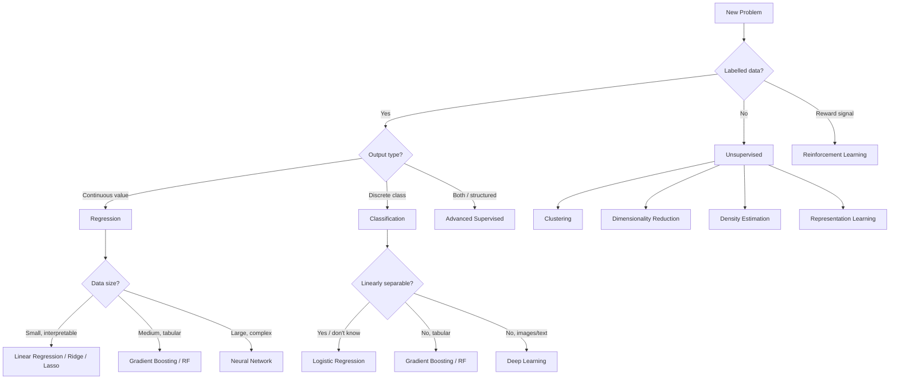

> A flat lookup table. When you're staring at a new dataset and need to decide where to start. For derivations, proofs, and implementation notes → [[00.Machine Learning]]

---

## ✦ How to Use This

**Step 1** — Identify your problem type (column 1) **Step 2** — Check your data conditions (scale, size, interpretability need) **Step 3** — Pick the row that fits. Start simple. Add complexity only when the simpler model fails.

> _"A model that works is better than a model that's interesting."_

---

## ✦ The Decision Map

---

## ✦ Supervised Learning — Regression

|Algorithm|Best When|Avoid When|Complexity (Train)|Complexity (Predict)|Key Hyperparameters|Interpretable?|
|---|---|---|---|---|---|---|
|**Linear Regression (OLS)**|Linear relationship, small $d$, need closed-form|Nonlinear data, $n \ll d$|$O(nd^2 + d^3)$ closed-form; $O(nd)$/epoch GD|$O(d)$|—|✅ Fully|
|**Ridge Regression (L2)**|Multicollinearity, all features relevant|True sparsity needed|Same as OLS|$O(d)$|$\lambda$|✅ Fully|
|**Lasso (L1)**|Sparse ground truth, feature selection needed|Correlated features (picks one arbitrarily)|$O(nd)$/iter|$O(d)$|$\lambda$|✅ Fully|
|**Elastic Net**|Correlated features + sparsity needed|—|$O(nd)$/iter|$O(d)$|$\lambda$, $\rho$|✅ Fully|
|**Polynomial Regression**|Smooth nonlinear relationship, low $d$|High $d$ (feature explosion), extrapolation|Same as linear on expanded features|$O(d^p)$|degree $p$|⚠️ Partial|
|**Decision Tree Regressor**|Nonlinear, interactions, need interpretability|Smooth functions, extrapolation|$O(nd \log n)$|$O(\log n)$|max_depth, min_samples|✅ Fully|
|**Random Forest Regressor**|Tabular, robust baseline, little tuning|Very high $d$ sparse (prefer linear), speed critical|$O(B \cdot nd\log n)$|$O(B \log n)$|n_estimators, max_features|⚠️ Partial|
|**Gradient Boosting (XGBoost / LightGBM)**|Tabular data, best predictive performance|Unstructured data (images, text), interpretability|$O(B \cdot nd)$|$O(B \log n)$|n_estimators, lr, max_depth|⚠️ Partial|
|**SVR (Support Vector Regression)**|Small-medium $n$, kernel trick needed|$n > 10^5$ (slow), many irrelevant features|$O(n^2 d)$ to $O(n^3)$|$O(n_{sv} \cdot d)$|$C$, $\epsilon$, kernel|❌ No|
|**Gaussian Process Regression**|Small $n$, uncertainty estimates needed|$n > 10^4$ (cubic cost), high $d$|$O(n^3)$|$O(n^2)$|kernel, noise $\sigma^2$|⚠️ Partial|
|**Neural Network (MLP)**|Large $n$, complex nonlinear, unstructured data|Small $n$, interpretability required|$O(B \cdot n \cdot \text{params})$|$O(\text{params})$|depth, width, lr, dropout|❌ No|

---

## ✦ Supervised Learning — Classification

|Algorithm|Best When|Avoid When|Complexity (Train)|Complexity (Predict)|Key Hyperparameters|Outputs Probability?|Interpretable?|
|---|---|---|---|---|---|---|---|
|**Logistic Regression**|Linearly separable, need calibrated probabilities, baseline|Strong nonlinear interactions|$O(nd)$/epoch|$O(d)$|$C$ (inverse $\lambda$)|✅ Calibrated|✅ Fully|
|**Linear Discriminant Analysis (LDA)**|Gaussian classes, small $n$, need dimensionality reduction|Non-Gaussian, class overlap|$O(nd^2)$|$O(d)$|—|✅|✅ Fully|
|**Naive Bayes (Gaussian)**|Very small $n$, continuous features, fast baseline|Strong feature correlations|$O(nd)$|$O(dk)$|var_smoothing|✅ (uncalibrated)|✅ Fully|
|**Naive Bayes (Multinomial)**|Text classification, count features|Non-count continuous features|$O(nd)$|$O(dk)$|$\alpha$ (Laplace)|✅ (uncalibrated)|✅ Fully|
|**k-Nearest Neighbours**|Small $n$, non-parametric, multimodal classes|High $d$, large $n$, speed needed|$O(1)$ (lazy)|$O(nd)$ naive; $O(\log n)$ KD-tree|$k$, metric|⚠️ Via voting|❌ No|
|**Decision Tree Classifier**|Need full interpretability, tree rules|Smooth boundaries, generalisation|$O(nd \log n)$|$O(\log n)$|max_depth, criterion|⚠️ Via leaf freq|✅ Fully|
|**Random Forest Classifier**|Tabular, strong baseline, robustness|Sparse high-$d$ (text), speed|$O(B \cdot nd\log n)$|$O(B \log n)$|n_estimators, max_features|✅|⚠️ Partial|
|**Gradient Boosting (XGBoost)**|Best tabular performance, Kaggle-level|Unstructured data, interpretability|$O(B \cdot nd)$|$O(B \log n)$|n_estimators, lr, max_depth, subsample|✅|⚠️ Partial|
|**SVM (Linear kernel)**|High-$d$ sparse data (text, genomics), medium $n$|$n > 10^5$, need probabilities natively|$O(nd)$ (SGD)|$O(d)$|$C$|❌ (need Platt)|❌ No|
|**SVM (RBF kernel)**|Small-medium $n$, nonlinear boundary|$n > 10^4$, high $d$|$O(n^2 d)$ to $O(n^3)$|$O(n_{sv} \cdot d)$|$C$, $\gamma$|❌ (need Platt)|❌ No|
|**Neural Network (MLP)**|Large $n$, complex nonlinear, deep features|Small $n$, interpretability|$O(B \cdot n \cdot \text{params})$|$O(\text{params})$|depth, width, lr, dropout|✅ (softmax)|❌ No|

---

## ✦ Unsupervised Learning — Clustering

|Algorithm|Best When|Avoid When|Complexity|Key Hyperparameters|Finds $k$ Automatically?|Handles Noise?|
|---|---|---|---|---|---|---|
|**K-Means**|Spherical clusters, known $k$, large $n$|Non-convex shapes, unknown $k$, outliers|$O(nkd \cdot \text{iter})$|$k$, n_init|❌|❌|
|**K-Means++**|Same as K-Means, better initialisation|Same as K-Means|Same|$k$|❌|❌|
|**Gaussian Mixture Model (EM)**|Soft assignments, elliptical clusters, density estimation|Large $n$, high $d$, initialisation sensitive|$O(nkd^2 \cdot \text{iter})$|$k$, covariance_type|❌ (use BIC)|⚠️ Partial|
|**Agglomerative (Ward)**|Small $n$, hierarchy needed, no $k$ required upfront|$n > 10^4$ (quadratic memory)|$O(n^2 \log n)$|n_clusters, linkage|⚠️ Via dendrogram|❌|
|**DBSCAN**|Arbitrary shapes, noise/outliers, unknown $k$|Varying density clusters, high $d$|$O(n \log n)$ with index|$\epsilon$, min_samples|✅|✅|
|**HDBSCAN**|Varying density, robust version of DBSCAN|Very high $d$|$O(n \log n)$|min_cluster_size|✅|✅|
|**Mean Shift**|Unknown $k$, blob-like clusters|Large $n$ (slow), high $d$|$O(n^2)$|bandwidth|✅|⚠️ Partial|
|**Spectral Clustering**|Non-convex shapes, graph-structured data|Large $n$ ($O(n^3)$ eigen), unknown $k$|$O(n^3)$ naive|n_clusters, affinity|❌|❌|

---

## ✦ Unsupervised Learning — Dimensionality Reduction

|Algorithm|Best When|Avoid When|Complexity|Output Dim|Invertible?|Use For|
|---|---|---|---|---|---|---|
|**PCA**|Linear structure, preprocessing, visualisation|Nonlinear manifolds|$O(nd^2)$ or $O(n^2 d)$ (SVD)|Any|✅ Exact|Preprocessing, compression, noise reduction|
|**Kernel PCA**|Nonlinear manifolds, known kernel structure|Large $n$ ($O(n^2)$ kernel matrix)|$O(n^2 d + n^3)$|Any|❌|Nonlinear feature extraction|
|**Truncated SVD (LSA)**|Sparse matrices, text (TF-IDF), large $n$|Dense data (PCA preferred)|$O(ndk)$|Any|✅ Approx|Text, recommendation|
|**t-SNE**|2D/3D visualisation of high-$d$ clusters|Feature extraction, $n > 10^5$, out-of-sample|$O(n^2)$ naive; $O(n \log n)$ Barnes-Hut|2–3 only|❌|Visualisation only|
|**UMAP**|Visualisation + feature extraction, faster than t-SNE|Interpretable geometry needed|$O(n^{1.14})$ approx|Any|⚠️ Approx|Visualisation, preprocessing|
|**Autoencoder**|Nonlinear compression, pretraining|Small $n$ (overfits), need exact reconstruction|Depends on arch|Bottleneck dim|✅ Approx|Representation learning, anomaly detection|
|**ICA**|Source separation (audio, EEG), non-Gaussian sources|Gaussian data (PCA better)|$O(nd^2 \cdot \text{iter})$|$d$|✅|Signal separation|
|**Random Projections**|Very large $n$ and $d$, approximate preservation|Exact structure needed|$O(nd k)$|Any|❌|Preprocessing at scale|

---

## ✦ Ensemble Methods

|Algorithm|Base Learner|Aggregation|Reduces|Train Parallelisable?|Typical Performance|
|---|---|---|---|---|---|
|**Bagging**|Any (usually trees)|Average / majority vote|Variance|✅|Good|
|**Random Forest**|Deep decision trees|Average / majority vote|Variance + correlation|✅|Very good|
|**Extra-Trees**|Extremely randomised trees|Average|Variance (more)|✅|Very good, faster|
|**AdaBoost**|Shallow trees (stumps)|Weighted vote|Bias + variance|❌ Sequential|Good|
|**Gradient Boosting**|Shallow trees|Additive (stage-wise)|Bias + variance|❌ Sequential|Excellent|
|**XGBoost**|Shallow trees|Additive + regularisation|Bias + variance|⚠️ Partial|State-of-art (tabular)|
|**LightGBM**|Shallow trees (leaf-wise)|Additive|Bias + variance|⚠️ Partial|State-of-art (tabular, fast)|
|**CatBoost**|Oblivious trees|Additive|Bias + variance|⚠️ Partial|State-of-art (categoricals)|
|**Stacking**|Any mix|Meta-learner|Both|✅ (base models)|Best (with risk of leakage)|

---

## ✦ Probabilistic Models

|Algorithm|Models|Inference|Key Assumption|Use Case|
|---|---|---|---|---|
|**Naive Bayes**|$P(x\|y)$ per feature|Exact (closed form)|Feature conditional independence|Text, fast baselines|
|**Linear Discriminant Analysis**|$P(x\|y) = \mathcal{N}(\mu_k, \Sigma)$|Exact|Shared covariance, Gaussian features|Small $n$, dimensionality reduction|
|**Quadratic Discriminant Analysis**|$P(x\|y) = \mathcal{N}(\mu_k, \Sigma_k)$|Exact|Per-class covariance, Gaussian|More flexible than LDA|
|**Hidden Markov Model**|Latent Markov chain + emissions|Forward-Backward, Viterbi|Markov, conditional emission independence|Sequences (speech, NLP, bio)|
|**Gaussian Process**|$f \sim \mathcal{GP}(m, k)$|Exact (regression); Approx (classification)|Smooth function prior via kernel|Small $n$, uncertainty quantification|
|**Bayesian Network**|DAG over $P(x_1,\ldots,x_n)$|Exact (small graphs); Approx (large)|Conditional independence structure|Causal reasoning, expert systems|
|**Latent Dirichlet Allocation**|Topics as Dirichlet mixtures|Variational EM or Gibbs|Bag-of-words, topics are distributions over words|Topic modelling|

---

## ✦ Reinforcement Learning

|Algorithm|Model-Based?|On/Off Policy|Value / Policy / Both|Best When|
|---|---|---|---|---|
|**Value Iteration**|✅|—|Value|Known MDP, small state space|
|**Policy Iteration**|✅|—|Both|Known MDP, faster convergence than VI|
|**Monte Carlo**|❌|Both|Value|Episodic tasks, no model|
|**TD(0) / SARSA**|❌|On|Value|Continuous tasks, on-policy|
|**Q-Learning**|❌|Off|Value|Discrete actions, off-policy learning|
|**DQN**|❌|Off|Value (NN)|High-dim state (images), discrete actions|
|**REINFORCE**|❌|On|Policy|Simple policy gradient baseline|
|**Actor-Critic (A2C)**|❌|On|Both|Continuous actions, lower variance than REINFORCE|
|**PPO**|❌|On|Both|State-of-art for continuous control, stable|
|**SAC**|❌|Off|Both|Continuous actions, sample efficiency|
|**Dyna-Q**|✅|Off|Value|Sample efficiency via model rollouts|

---

## ✦ Algorithm Selection by Data Condition

### By dataset size

|$n$ (samples)|Recommended starting point|
|---|---|
|$n < 100$|Gaussian Process, LDA, Naive Bayes, Linear model with strong regularisation|
|$100 < n < 10^4$|Logistic/Linear regression, SVM (RBF), Random Forest, GMM|
|$10^4 < n < 10^6$|Gradient Boosting (XGBoost/LightGBM), Random Forest, Neural Network|
|$n > 10^6$|SGD-based linear models, Neural Networks, LightGBM (histogram)|

### By feature type

|Feature type|Notes|
|---|---|
|**All numerical, continuous**|Almost anything works. Scale for KNN, SVM, NNs. Trees are scale-invariant.|
|**Mixed numerical + categorical**|CatBoost (native), LightGBM (native), or encode then anything|
|**High-cardinality categorical**|Target encoding (with CV), hashing trick, entity embeddings (NN)|
|**Text**|TF-IDF + linear SVM/LogReg (fast, strong baseline), then Transformer|
|**Images**|CNN, Vision Transformer — do not use classical ML directly on pixels|
|**Time series**|Feature engineer lags + GBM, or sequence models (LSTM, Transformer)|
|**Graph-structured**|Graph Neural Networks, Spectral Clustering|
|**Very high $d$, sparse** (text, genomics)|Linear SVM, Logistic Regression (L1), Truncated SVD first|

### By requirement

|Requirement|Algorithms to prefer|
|---|---|
|**Full interpretability**|Linear/Logistic Regression, Decision Tree, LDA|
|**Feature importance**|Random Forest (impurity), XGBoost (gain), any model + SHAP|
|**Calibrated probabilities**|Logistic Regression, calibrated RF/GBM (Platt scaling / isotonic)|
|**Uncertainty estimates**|Gaussian Process, Bayesian NN, Deep Ensembles, MC Dropout|
|**Fast training**|Linear models, Naive Bayes, LightGBM, Extra-Trees|
|**Fast inference**|Linear models, Decision Trees|
|**No scaling needed**|Tree-based models (RF, GBM, XGBoost, Decision Tree)|
|**Works with missing values natively**|XGBoost, LightGBM, CatBoost|
|**Anomaly detection**|Isolation Forest, One-Class SVM, Autoencoder, DBSCAN (noise points)|
|**Online / streaming learning**|SGD (linear models), Hoeffding Tree, Passive-Aggressive|

---

## ✦ Regularisation Cheatsheet

|Regulariser|Penalty|Effect|Bayesian Equivalent|Models|
|---|---|---|---|---|
|**L2 (Ridge)**|$\lambda \|w\|_2^2$|Shrinks all weights, never zero|Gaussian prior on $w$|Linear, Logistic, NN (weight decay)|
|**L1 (Lasso)**|$\lambda \|w\|_1$|Sparse weights, feature selection|Laplace prior on $w$|Linear, Logistic|
|**Elastic Net**|$\lambda_1\|w\|_1 + \lambda_2\|w\|_2^2$|Sparse + grouped selection|—|Linear, Logistic|
|**Dropout**|Random zero activations during training|Ensemble of thinned networks|Approx. Bayesian|Neural Networks|
|**Early stopping**|Stop before convergence|Limits effective model complexity|Equivalent to L2 (for GD)|Any gradient-based|
|**Max-norm constraint**|$\|w\|_2 \leq c$|Bounds weight magnitude|—|Neural Networks|
|**Data augmentation**|Expand training set artificially|Reduces variance|—|Images, audio, text|
|**Batch normalisation**|Normalise layer inputs|Smooths loss landscape, implicit regularisation|—|Neural Networks|

---

## ✦ Loss Functions at a Glance

|Loss|Formula|Use Case|Sensitive to Outliers?|
|---|---|---|---|
|**MSE**|$\frac{1}{n}\sum(y_i - \hat{y}_i)^2$|Regression, Gaussian noise|✅ Yes|
|**MAE**|$\frac{1}{n}\sum\|y_i - \hat{y}_i\|$|Regression, robust to outliers|❌ No|
|**Huber**|Quadratic near 0, linear beyond $\delta$|Regression, best of both|❌ No|
|**Binary Cross-Entropy**|$-[y \log \hat{p} + (1-y)\log(1-\hat{p})]$|Binary classification|—|
|**Categorical Cross-Entropy**|$-\sum_k y_k \log \hat{p}_k$|Multi-class classification|—|
|**Hinge**|$\max(0, 1 - y\hat{y})$|SVM (binary classification)|—|
|**KL Divergence**|$\sum_x P(x)\log\frac{P(x)}{Q(x)}$|Variational inference, VAEs|—|
|**Log-Loss**|Same as binary cross-entropy|Probabilistic classifiers|—|

---

## ✦ Complexity Reference

> $n$ = samples, $d$ = features, $k$ = classes or clusters, $B$ = estimators, $n_{sv}$ = support vectors

|Algorithm|Train|Predict|Space|
|---|---|---|---|
|Linear Regression (GD)|$O(nd)$/epoch|$O(d)$|$O(d)$|
|Logistic Regression (GD)|$O(nd)$/epoch|$O(d)$|$O(d)$|
|KNN|$O(1)$|$O(nd)$ naive|$O(nd)$|
|SVM (kernel)|$O(n^2 d)$–$O(n^3)$|$O(n_{sv} d)$|$O(n_{sv})$|
|Decision Tree|$O(nd \log n)$|$O(\log n)$|$O(n)$|
|Random Forest|$O(B \cdot nd\log n)$|$O(B \log n)$|$O(Bn)$|
|Gradient Boosting|$O(B \cdot nd)$|$O(B \log n)$|$O(Bn)$|
|K-Means|$O(nkd \cdot \text{iter})$|$O(kd)$|$O((n+k)d)$|
|PCA (SVD)|$O(nd\min(n,d))$|$O(dk)$|$O(nd)$|
|Gaussian Process|$O(n^3)$|$O(n^2)$|$O(n^2)$|

---

## ✦ The Baseline Rule

> Before any complex model, establish a baseline. If your fancy model can't beat the baseline, you have a data problem, not a model problem.

|Task|Baseline to beat|
|---|---|
|Regression|Predict the training mean for all samples|
|Classification|Predict the majority class always|
|Ranking|Random ranking|
|Time series|Last observed value (naive forecast)|
|Clustering|K-Means with $k=2$|

---

_For derivations and implementation notes on any row in this table → [[00.Machine Learning]]_ _For feature engineering before choosing a model → [[02.Feature Engineering]]_ _For evaluation metrics → [[03.Performance Metrics]]_