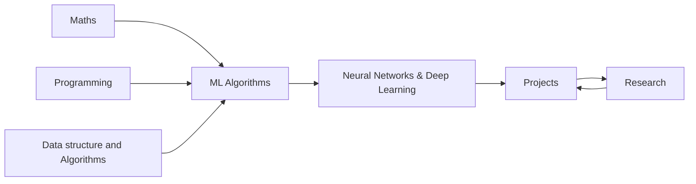

---

## title: AI & ML Learning Journal tags: [ai, machine-learning, learning, personal]

# My AI/ML Learning Journal

I started this because I got tired of finishing courses and feeling like I understood nothing. You know that feeling — you follow along, it makes sense in the moment, and then you close the laptop and it's just... gone. So this is my attempt to actually _learn_ this stuff. Not just consume it.

The deal I made with myself: if I can't explain it, derive it, or build it — I don't really know it yet.

This vault is where I think out loud. It's messy sometimes. That's fine.

---

## Where I'm trying to get to

Somewhere I can look at a real problem, know which tools make sense, build something that actually works, and understand _why_ it works. I want to read papers without feeling lost. I want to contribute something, eventually — even if that's small.

That's the north star. Everything else is just steps toward it.

---

## The map

I keep coming back to this rough ordering. It's not perfectly linear — some things feed back into each other — but it's how I think about the dependencies.

The loop at the end is intentional. Projects surface gaps. Research fills them. Repeat.

---

## What I'm working through

### Maths

Honestly the part I kept putting off. Linear algebra finally clicked when I stopped trying to memorize operations and started thinking about what they _do_ to space. Calculus is coming back slowly. Probability is probably the one I'll revisit the most — everything in ML eventually becomes a probability question.

- [ ] Linear algebra — got the intuition, working on the depth
- [ ] Multivariable calculus — chain rule, gradients, the whole thing
- [ ] Probability & statistics — distributions, Bayes, MLE
- [ ] Information theory — entropy, KL divergence (still murky)
- [ ] Optimization — convexity, gradient descent variants

> One thing I've noticed: whenever something in ML feels like magic, there's usually a piece of maths I skipped. Going back and filling those in is always worth it.

[[Maths]]

---

### Programming & Computational Thinking

I can write Python. What I'm building here is the _discipline_ — writing code that's readable six months later, that I can actually debug, that separates the ML logic from the engineering mess.

- [ ] Idiomatic Python — not just "it works" but "it's clear"
- [ ] NumPy and vectorized thinking — stop writing for loops
- [ ] Complexity analysis — knowing why something is slow
- [ ] Clean experiment code — reproducible, logged, comparable
- [ ] Software patterns that actually show up in ML codebases

[[Programming and Computational Thinking]]

---

### Data Structures & Algorithms

This one I do partly for the problem-solving muscle, partly because understanding how data is stored and traversed makes me a better ML engineer. Trees show up everywhere once you start looking.

- [ ] Core structures — arrays, trees, heaps, graphs
- [ ] Sorting, searching, DP — the classics
- [ ] Graph algorithms — BFS, DFS, Dijkstra
- [ ] Hashing, bloom filters, probabilistic stuff
- [ ] Consistent practice — a problem or two, regularly

[[Data Structures and Algorithms]]

---

### Machine Learning Algorithms

This is where I'm spending a lot of time right now. The goal isn't to use sklearn — it's to understand what sklearn is doing and why. Deriving things by hand is slow and occasionally humbling, but it sticks.

| Area          | Topics                                   | Where I'm at       |
| ------------- | ---------------------------------------- | ------------------ |
| Supervised    | Linear/Logistic Regression, SVMs, Trees  | working through it |
| Unsupervised  | K-Means, PCA, DBSCAN                     | up next            |
| Ensemble      | Random Forests, Gradient Boosting        | planned            |
| Probabilistic | Naive Bayes, Gaussian Processes          | planned            |
| Evaluation    | Bias-variance, cross-validation, metrics | ongoing            |

> The moment I actually derived the normal equation for linear regression instead of just accepting it — something shifted. That's the mode I want to stay in.

[[Machine Learning Algorithms]]

---

### Neural Networks & Deep Learning

The part everyone wants to jump to. I'm trying not to rush it. Backprop especially — I want to implement it from scratch before I let myself use autograd freely. I think that's important.

- [ ] Backpropagation — derive it, implement it, _then_ forget about it
- [ ] CNNs — convolution as an operation, not just a function call
- [ ] RNNs, LSTMs — why vanishing gradients are a real problem
- [ ] Transformers — attention from scratch, not just "here's the architecture"
- [ ] Generative models — VAEs, GANs, diffusion (the exciting frontier)
- [ ] All the training tricks — normalization, regularization, schedulers

[[Neural Networks and Deep Learning]]

---

### Projects

The rule I set: no tutorial projects. Everything either comes from a problem I actually care about, or from reproducing something I read in a paper. The learning happens in the gap between "I think I understand this" and "I made it work."

| Project                        | What it taught me                                  | Status      |
| ------------------------------ | -------------------------------------------------- | ----------- |
| Linear Regression from scratch | The geometry of loss surfaces                      | ✅ done      |
| Neural Net in NumPy            | Backprop is just the chain rule, applied carefully | in progress |
| Transformer from scratch       | —                                                  | next        |
| Something with diffusion       | —                                                  | eventually  |

[[Projects]]

---

### Research & Reading

I'm trying to build the habit of reading papers regularly. Not skimming — actually sitting with them. The goal isn't to read everything; it's to read carefully and know what questions to ask.

- [ ] At least one paper a week, properly digested
- [ ] Reproduce something I read — even partially
- [ ] Keep a log of things I don't understand yet (it's long)
- [ ] Follow cs.LG, cs.AI, stat.ML on arXiv

[[Research and Continuous Learning]]

---

## Journal entries

This is the part I find hardest to keep up with, but also the most valuable when I do. Looking back at old entries and seeing what confused me then — and doesn't now — is genuinely motivating.

I try to write everyday. No pressure to be polished. The point is honesty.

[[Learning Journal|All entries →]]

---

## A note to myself

This is going to take longer than I want it to. There will be weeks where nothing clicks and the material feels impenetrable. That's part of it.

The version of me that gets where I'm trying to go is just the current version, kept going.

---

