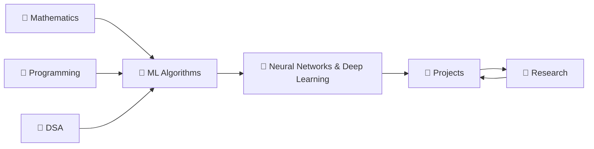

  
learning journal · ai & machine learning

  <h1 class="hero-title">
    First principles. 
    No hand-waving. 
    <em>Actually learned.</em>
  </h1>
  

    A rigorous notebook built around one rule: if I can't derive it, implement it from scratch, and explain it clearly — I don't know it yet. Everything here has been earned, not consumed.
  

<strong>The deal I made with myself:</strong> 
Read the note → Derive the key equations by hand → Implement from scratch 
→ Verify against sklearn/PyTorch → Only then move on.  
The version of me that gets where I'm trying to go is just the current version, kept going.

---

## ✦ The Map

The loop at the end is intentional. Projects surface gaps. Research fills them. Repeat.

---

## ✦ Start Here

  <a class="card" href="01.Maths/00.Maths/" style="--card-accent: #f59e0b;">
    📐
    
Mathematics

    
Linear algebra, calculus, probability, statistics. The substrate everything else is built on.

  </a>

  <a class="card" href="02.Python/00.Python/" style="--card-accent: #3b82f6;">
    🐍
    
Programming

    
Python from first principles through NumPy, vectorized thinking, and clean ML code.

  </a>

  <a class="card" href="03.Data Structure and Algorithms/" style="--card-accent: #10b981;">
    🌲
    
Data Structures & Algorithms

    
Core structures, graph algorithms, dynamic programming. The problem-solving muscle.

  </a>

  <a class="card" href="04.ML/00.Machine Learning/" style="--card-accent: #8b5cf6;">
    🤖
    
Machine Learning

    
Supervised, unsupervised, ensembles, probabilistic models — all derived, not just used.

  </a>

  <a class="card" href="05.Neural Networks & Deep Learning/" style="--card-accent: #ec4899;">
    🧠
    
Deep Learning

    
Backprop from scratch. CNNs, RNNs, Transformers, diffusion. Autograd comes last.

  </a>

  <a class="card" href="06.Projects/" style="--card-accent: #06b6d4;">
    🔬
    
Projects

    
No tutorial projects. Real problems, paper reproductions, and things I actually care about.

  </a>

---

<h2>Current Progress</h2>

<table class="status-table">
  <thead>
    <tr>
      <th>Area</th>
      <th>Focus</th>
      <th>Status</th>
    </tr>
  </thead>
  <tbody>
    <tr>
      <td><strong>Python Fundamentals</strong></td>
      <td>Variables → OOP → Decorators → Pythonic patterns</td>
      <td>active</td>
    </tr>
    <tr>
      <td><strong>Linear Algebra</strong></td>
      <td>MIT 18.06 — got the intuition, building the depth</td>
      <td>active</td>
    </tr>
    <tr>
      <td><strong>Probability</strong></td>
      <td>Harvard Stat 110 — distributions, Bayes, MLE</td>
      <td>active</td>
    </tr>
    <tr>
      <td><strong>Supervised ML</strong></td>
      <td>Linear/Logistic regression, SVMs — deriving by hand</td>
      <td>active</td>
    </tr>
    <tr>
      <td><strong>Unsupervised ML</strong></td>
      <td>K-Means, PCA, DBSCAN, GMM/EM</td>
      <td>up next</td>
    </tr>
    <tr>
      <td><strong>Ensemble Methods</strong></td>
      <td>Random Forests, Gradient Boosting, XGBoost</td>
      <td>planned</td>
    </tr>
    <tr>
      <td><strong>Backpropagation</strong></td>
      <td>Implement from scratch in NumPy before touching autograd</td>
      <td>planned</td>
    </tr>
    <tr>
      <td><strong>Transformers</strong></td>
      <td>Attention from scratch — not just "here's the architecture"</td>
      <td>planned</td>
    </tr>
    <tr>
      <td><strong>Linear Regression (scratch)</strong></td>
      <td>Normal equation, geometry of loss surfaces</td>
      <td>done</td>
    </tr>
  </tbody>
</table>

---

## ✦ How This Notebook Works

  

    01
    Derive first. Every key result gets worked out by hand before being used.
  

  

    02
    Implement from scratch. NumPy before sklearn. sklearn before PyTorch.
  

  

    03
    Know the prerequisites. If something feels like magic, there's a skipped step.
  

  

    04
    Exit criteria per note. Don't move forward until you can clear it cold.
  

---

## ✦ The Reading Stack

These are the eleven books and six courses this vault is built around:

=== "Books"

    | Book | Domain | When |
    |------|--------|------|
    | Programming: Principles & Practice (C++) | Systems | Phase 1 |
    | Discrete Mathematics & Its Applications | Foundations | Phase 1 |
    | Introduction to Linear Algebra (Strang) | Maths | Phase 1 |
    | Introduction to Algorithms (CLRS) | DSA | Phase 1–2 |
    | Introduction to Probability | Maths | Phase 1–2 |
    | Computer Systems: A Programmer's Perspective | Systems | Phase 2 |
    | Operating System Concepts | Systems | Phase 2 |
    | Database System Concepts | Systems | Phase 2 |
    | Artificial Intelligence: A Modern Approach | AI | Phase 2–3 |
    | Pattern Recognition and Machine Learning | ML | Phase 3 |
    | Deep Learning (Goodfellow) | DL | Phase 3 |

=== "Courses"

    | Course | Institution | Synergises With |
    |--------|-------------|-----------------|
    | Stat 110 | Harvard | PRML, probability notes |
    | Linear Algebra 18.06 | MIT | PCA, NNs, all of ML |
    | Statistics 18.650 | MIT | ML evaluation, inference |
    | Multivariable Calculus 18.02 | MIT | Backprop, optimisation |
    | Machine Learning CS229 | Stanford | Entire ML section |
    | CNNs CS231n | Stanford | Deep learning section |

---

This is going to take longer than I want it to. 
There will be weeks where nothing clicks and the material feels impenetrable. 
That's part of it.  
<strong>The version of me that gets there is just the current version, kept going.</strong>

