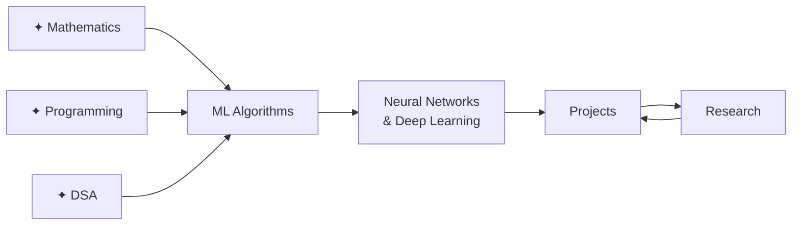

---
title: AI/CS Knowledge Base
---

<div class="home-hero">
  <div class="hero-label">PERSONAL RESEARCH VAULT</div>
  <h1 class="hero-title">The Long Road<br><em>to Understanding</em></h1>
  <p class="hero-sub">
    A working mathematician's notebook. Not a tutorial, not a summary — a map built by someone who refused to move forward until the foundations were solid.
  </p>
  <div class="hero-quote">
    <span>"A computer program is said to learn from experience E… if its performance at tasks in T, as measured by P, improves with experience E."</span>
    <span class="hero-quote-attr">— Tom Mitchell, 1997</span>
  </div>
</div>

<div class="home-meta-row">
  <div class="meta-chip">📚 11 Books</div>
  <div class="meta-chip">🎓 6 Courses</div>
  <div class="meta-chip">⏱ 90-Day Goal</div>
  <div class="meta-chip">🔬 First-Principles Only</div>
</div>

---

## The Map

The ordering below is intentional. Each layer assumes the one beneath it is solid. There are no shortcuts.



The loop at the end is intentional. Projects surface gaps. Research fills them. Repeat.

---

## The Foundations

> *"Whenever something in ML feels like magic, there's usually a piece of mathematics I skipped."*

### [[00.Maths|✦ Mathematics]]

The part most people skip. Skipping it is why most people plateau.

| Domain | Topics | Status |
|---|---|---|
| Linear Algebra | Vector spaces, eigendecomposition, SVD | In progress |
| Multivariable Calculus | Gradients, Jacobians, chain rule | Active |
| Probability & Statistics | Distributions, Bayes, MLE, MAP | Active |
| Information Theory | Entropy, KL divergence, mutual info | Planned |
| Optimization | Convexity, GD variants, Lagrangians | Planned |

**Why it matters for ML:** Every algorithm reduces to linear algebra + calculus + probability. PCA is an eigendecomposition. Backprop is the chain rule. Training is optimization. The math *is* the algorithm.

---

### [[00.Python|✦ Programming & Computational Thinking]]

The discipline of writing code you can still read six months later. The ML logic separated from the engineering mess.

**Phase 1 → Master first:** Syntax · Control Flow · Data Structures · Functions

**Phase 2 → Before NumPy:** OOP · Iterators & Generators · Error Handling · File I/O

**Phase 3 → Before ML code:** Modules · Memory Model · Decorators · Pythonic Patterns

Once Phase 3 is complete, NumPy → Pandas → PyTorch/TensorFlow all make sense because every abstraction maps directly back to these primitives.

---

### [[00.Data Structures and Algorithms|✦ Data Structures & Algorithms]]

Problem-solving muscle. Also: trees appear everywhere in ML once you start looking.

- Core structures: arrays, trees, heaps, graphs, hash maps
- Sorting, searching, dynamic programming — the classical repertoire
- Graph algorithms: BFS, DFS, Dijkstra, Bellman-Ford
- Complexity analysis — knowing *why* something is slow

---

## Machine Learning

> *"The moment I derived the normal equation for linear regression instead of just accepting it — something shifted. That's the mode I want to stay in."*

### [[00.Machine Learning|✦ ML Algorithms]]

The goal is not to use `sklearn`. The goal is to understand what `sklearn` is doing, derive it by hand, implement it from scratch, *then* use the library.

**The exit criterion for every section:** Can you derive the key equations without looking them up? Can you implement it in ~50 lines of NumPy? Can you explain *why* it works to someone starting from scratch?

| Area | Core Algorithms | Reference |
|---|---|---|
| Supervised | Linear/Logistic Regression, SVM, Decision Trees | ESL Ch. 3–4, 12 |
| Probabilistic | Naive Bayes, Gaussian Processes, GLMs | PRML Ch. 3–6 |
| Ensemble | Random Forests, Gradient Boosting, XGBoost | ESL Ch. 10, 15 |
| Unsupervised | K-Means, PCA, GMM, DBSCAN | PRML Ch. 9, 12 |
| Evaluation | Bias-variance, CV, Metrics, Regularisation | ESL Ch. 7 |
| Reinforcement | MDPs, Q-Learning, Policy Gradients | AIMA Ch. 21 |

---

### [[Neural Networks and Deep Learning|✦ Neural Networks & Deep Learning]]

The part everyone wants to jump to. The plan: implement backprop from scratch before touching autograd. That sequence is important.

- Backpropagation — derive, implement, *then* forget
- CNNs — convolution as a mathematical operation, not a function call
- RNNs, LSTMs — vanishing gradients as a real problem with a derivable cause
- Transformers — attention from scratch, not just a diagram
- Generative models — VAEs, GANs, diffusion

---

## Active Projects

The rule: no tutorial projects. Everything either solves a problem I actually care about, or reproduces something from a paper.

| Project | Core Idea | Status |
|---|---|---|
| Linear Regression from scratch | Geometry of loss surfaces | ✅ Complete |
| Neural Net in NumPy | Backprop as applied chain rule | 🔄 In progress |
| Transformer from scratch | Attention mechanism, positional encoding | 📋 Next |
| Diffusion model | Score matching, DDPM paper | 📋 Eventually |

---

## The Reading Stack

### Books

| # | Title | Domain | Progress |
|---|---|---|---|
| 1 | Programming: Principles and Practice (C++) | Systems | Active |
| 2 | Discrete Mathematics and Its Applications | Foundations | Active |
| 3 | Introduction to Linear Algebra — Strang | Mathematics | Active |
| 4 | Introduction to Algorithms — CLRS | DSA | Planned |
| 5 | Introduction to Probability — Blitzstein | Statistics | Active |
| 6 | Computer Systems: A Programmer's Perspective | Systems | Planned |
| 7 | Operating System Concepts | Systems | Planned |
| 8 | Database System Concepts | Systems | Planned |
| 9 | Artificial Intelligence: A Modern Approach | AI | Planned |
| 10 | Pattern Recognition and Machine Learning | ML | Active |
| 11 | Deep Learning — Goodfellow | DL | Planned |

### Courses

| Course | Institution | Status |
|---|---|---|
| Stat 110 — Probability | Harvard | Active |
| 18.06 — Linear Algebra | MIT | Active |
| 18.650 — Statistics | MIT | Planned |
| 18.02 — Multivariable Calculus | MIT | Planned |
| CS229 — Machine Learning | Stanford | Planned |
| CS231n — CNNs for Visual Recognition | Stanford | Planned |

---

## A Note to Myself

```
This is going to take longer than I want it to.
There will be weeks where nothing clicks
and the material feels impenetrable.
That is part of it.

The version of me that gets where I am trying to go
is just the current version, kept going.
```

---

 *Built with [Quartz](https://quartz.jzhao.xyz) · Hosted on [GitHub Pages](https://github.com/Bushraabir/Ai-Machine-Learning)*